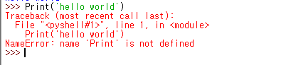
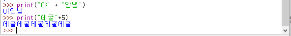
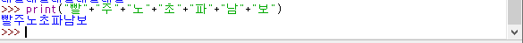
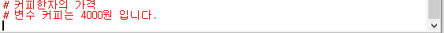

# 20191009 파이썬 시작 1강부터 40강 까지


>  김왼손의 한입에 쏙 파이썬
>
> : https://www.youtube.com/watch?v=V4atcoogC9w&list=PLGPF8gvWLYyontH0PECIUFFUdvATXWQEL&index=3
>
> 파이썬을 프로젝트에 쓰고 있다.하는데 너무 답답해서 공부를 할 필요가 있다고 생각이 들었다. 강의가 짧막하게 2분에서 3분 내외이기 때문에 후루룩 보기위해서 원래알고 있던 유튜버이기도 해서 공부를 하고 요약을 해서 올려본다.

 

### 1. 파이썬의 장점(왜 파이썬을 배우는가?)

1. 파이썬은 간단하다.
2. 참고할 자료들이 많다. (ex 스택오버 플로우, 생활코딩 등등)
3. 빠르게 만들 수 있다.


### 2.  파이썬은 어디서 사용?

1. 구글 및 수많은 곳에서 사용을 하고 있다.
2. 딥러닝, 빅데이터, 게임 등등에서 사용하는 범용 프로그래밍 언어


### 3. 파이썬의 시작


#### 3-1. 파이썬의 환경 시작

다운로드:  https://www.python.org/downloads/


> 처으에 시작할 때  Add Python Path 란이 보일 것이다. 이것만 체크를 해주고 나머지는 디폴트값. 즉, 그냥 Next를 눌러주면 된다.  엄청 간단하다. 


### 4. 기본 개발 환경

asset/1570612876865.png


>  처음에 아이들 프로그램을 시작했을 때의 화면. (대화형 쉘이라고도 말함.)


### 5.시작은역시 hello world

[1570613034434](assets/1570613034434.png)

> print 를 Print 라고 치면 못알아 듣는다. 문법을 잘 지켜서 가즈아 ~




### 6. 데이터 타입(숫자형, 문자형)


#### 6-1.숫자형

**정수, 실수**


> 파이썬에서 숫자는 print를 써도 되고, 안 써도 출력이 가능하다.


**연산자**


> **" * "** 에스트리크 라고 부른다. 처음 취성패에서 선생님이 자꾸 에스트리크 라고 말씀하시는데 먼가? 싶어가지고 그냥 지나갔다. 가끔 아주아주~~~~~~~~ 자주 듣는 용어들은 알아두자.


> ** 제곱 // 몫  % 나머지


#### 6-2.문자열

>  문자열은  '문자열' or "문자열" 작은 따음표, 큰따음표가 필요하다. 더블 커테이션이라고 부른다.  예는 위에 위치한 헬로우 월드를 볼 수 있다.


**문자열 연산**

> +와 *가 있다. +는 문자열과 문자열을 붙일 때 사용을 한다. *는 ex) 문자열 *N (N은 정수)를 해주게 되면 곱한 만큼 반복해서 출력을 해준다. 








### 7.변수 

> 변수 이름 = 저장할 값 : 저장할 값을 =의 오른쪽에 위치하여 변수값에 저장을 한다.
>
> 


#### 7-1 변수 이름 짓기

- 문자와 숫자, _ 를 사용 할 수 있습니다.
- 대문자와 소문자를 구분합니다.
- 공백을 사용할 수 없습니다.
- 숫자로 시작할 수 없습니다.
- 미리 예약된 이름은 사용할 수 없습니다.(명령어)


### 8.주석

> 우리가 아주 긴 코드를 짠다고 생각을 해보자. 수많은 변수명이 있을 것이고, 구조 또한 나만의 형식일 가능성이 높다. 그런데 그 소스를 이용해서 다른 사람과 같이 협업을 한다. 그런데 이 사람은 또 자신만의 방식이 있을 것이다. 이럴 때 쓰는 것이 바로 주석이라는 기능이다. ""다른 사람을 위한 메모"" 라고 생각하면 좋을 것 같다.





### 9.리스트 형식


> 위의 예제처럼 변수들을 여러가지를 정하고 쓸 수도 있다. 하지만 상당히 귀찮은 일이다. 변수명이 많이 생기는 것도 힘들지만, 이것들을 일일이 타자를 치는건 효율적이지 못하다. 그래서 list 형식으로 하나의 변수에 저장을 하는 것이다.
>
> [값1,값2,값3,값4,]


> 그래서 많은 양의 변수를 저장 관리할 수 있다.


#### 9-1.값을 추가 하기


> list 에 append(추가할 값)를 이용해서 list 에다가 값을 추가할 수 있다.
>
> list(명).append(추가할_값)

 


> 예제로 clover라는 변수에 데이터를 넣어주었다. 그리고 append 메소드를 이용해서 데이터를 하나 더 넣어주었다. 이미지에서 에러가 난것은 append  함수를 통해서는 한 번에 하나씩 넣어야 한다는 것!! 2개를 넣으려고 하니 에러가 난다. 그리고 append 를 하는 것은 순서대로 값이 추가가 된다.


#### 9-2.값에 접근하기

> 데이터를 불러오고 싶다. 어떻게 접근을 할까? 각각의 데이터에는 주소가 있는데 이를 인덱스라고 부른다. 인덱스는 0번 부터 시작을 한다.


> 앞에서 했던 예제를 이용해서 진행해보았다. clover에 보면 앞에 0번에 있는 데이터를 보고 싶다. 그래서 "리스트명 [리스트 넘버]" 형식으로 입력을 해주면 출력한다.


####  9-3.값제거하기


> 변수에 있는 데이터 하나를 제거하고 싶다. 그러면 명령어  del 리스트명[제거할 인덱스] 라고 치면 수행하는 것을 볼 수 가 있다.


#### 9-4 예제


> 가끔 보면 타자를 겁나게 빠르게 치시는 분들이 있다. 그런데 거기에는 이유가 있다. 그분들은 tab키를 잘 이용하신다. 앞에서 변수명 candies를 다 칠필요가 없다. tab  한번 눌러주면 자동완성을 시켜주고, 만약 겹치는 것들이 있다면 선택창이 뜰 것이다. 


#### 9-4. 여러가지 값을 가지고 오기(슬라이싱)


> 위에서는 여러가지 데이터를 가지고 오는 예제를 진행해 보았다. '리스트명[시작 인덱스 : 끝 인덱스 +1]'이다.  위의 예제를 보면 나는 1:3 이라고 쳤지만 화, 수 만 가지고 오는 것을 볼 수가 있다. 즉 [1:2] 값 만 가지고 온 것을 확인한다. +1 기억하자


#### 9-5. 예제2


> 예제를 들어가기 전에 이전에 썻던 변수를 삭제하고 싶었다. 인터넷에서 찾아보니 위의 입력문 처럼  'del 변수명' 을 해주면 된다. 파이썬은 참 간단한 것 같다. ^^


> +를 쓰니가 틀렷다. 


### 10. 정렬하기

> 리스트명.sort() :  가나다순, 알파벳순 으로 정렬해준다.


#### 10-1.리스트 세기

> 리스트명.count() : 리스트의 데이터의 순서를 알려준다. 


### 11. 횟수 반복하기(for문)


> 위의 코드처럼 5000마리의 거북이들에게 인사를 하려한다... 생각만해도 끔찍하지 않은가? 5000번이나 저 코드를 쳐야한다니... 그래서 이를 쉽게 하는 법이 있다.


> 바로 for문을 사용하는 것이다. 잠시만요.


그런데 여기서 부터 위에서도 알 수 있지만 이제 한문장 한문장 대화하듯이 못 할것 같다. 코드의 길이가 슬슬 길어지기 시작 할 때가 되었다. 그래서 **IDLE 에디터**를 사용할 시간이 왔다. 파일에서 new file 을 실행하고 저장을 한 후에 IDLE 에서 불러와서 진행하면 엔터를 치더라도 출력이 되지 않는 것을 볼 수가 있다.


> 위의 이야기를 이어서 진행을 해보려 한다.  for문에 관한 것이다. 형식은

```python
for 변수 in 리스트: 

	(들여쓰기 필수)실행할 명령어
```


#### 11-1.예제

> for 와 print()를 사용해서 player들에게 퇴장 명령을 내려보세요.


### 12.문자열 반복하기

```python
for 변수 in 문자열:
	실행할 명령
```


### 13. 들여쓰기

> 들여쓰기는 파이썬에서는 필수적인 방식이다. 들여쓰기 탭과 스페이스바 4번은 다른 방식이기 때문에 언제나 통일이 되어야 한다. 인단 뛰어쓰기 4칸을 추천한다.


### 14. 순서열 만들기


> range(끝 값+1) : 정수를 넣어준다. 그리고 그 정수보다 하나 작은 범위까지 입출력이되므로, +1 한 값을 입력해줘야한다. like index


> range(시작값 , 끝값+1) : 이번에는 숫자가 2개 들어간다. 그러면 시작값부터 끝깞 까지의 생각을 하면된다. 이러한 방식으로 구구단을 만들어봤다. 


#### 14-1.예제


### 15. 조건문(while)


#### 15-1 참과 거짓(논리형)


> 참과 거짓. 여기서 알아야 할 점은 True를 할 때 T를 대문자로 해줘야 한다는 점이다. 그렇지 않으면 위의 예제 처럼 true를 할 경우 에러가 난다.


#### 15-2 값 비교하기

- **>**,**<**크냐? 작냐?
- == 같다. != 같지 않다.

