# 20191012 파이썬 41~강

> 요약한 영상 : 한입에 쏙 파이썬 https://www.youtube.com/watch?v=suBE-ZBaOds&list=PLGPF8gvWLYyontH0PECIUFFUdvATXWQEL&index=41


### 1.if 기본 구조 

```python
if 조건:
    실행할 명령    
    
#참이면 넘어가고 거짓이면 안됨.겁나 간단데스.
```

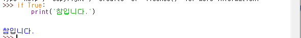


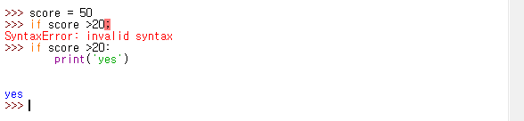

### 2. else 와 elif

```python
if 조건:
	실행할 명령1
else:
	실행할 명령2
```


```python
if 조건1:
	실행할 명령1
elif 조건2:
	실행할 명령2
else:
	실행할 명령3
```


#### 2-1.예제


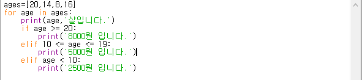


> 슥 보고 풀어본건데... 잘 모르겠으.... 아직도 수양 부족하다.


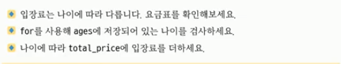


> ages는 자기가 직접 정해서 하고 나이가 20세 이상은 8000원,10세에서 19세는 5000원,10세 미만은 2500원으로 힌트는 for 와  if 를 이용해서 풀면 됩니다.


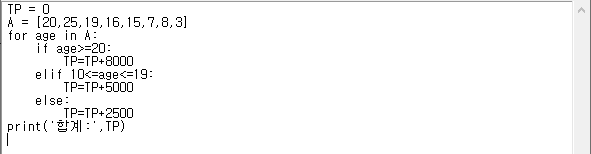


### 3. 여러조건 판단하기 : 논리 연산자


- 조건 1 and 조건 2 : 둘다 조건식이 맞을 때
- 조건 1 or조건 2: 둘중 하나만 조건식이 맞을 때
- not 조건: 결과를 뒤집어서 표현하기 


#### 3-1. 예제


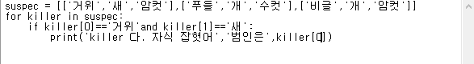


### 4. While 문


```python
while 조건:
	실행한 명령
```


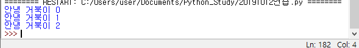


#### 4-1.예제


>  ㅎㅎ 한번에 맞췄다 (5 Second Later).. 아니네.. ㅎ


### 5.입력을 받는 방법

```python
input()
```


> 키보드를 입력을 받아주는 함수. 단 문자열로 입력을 받는 다고 한다.


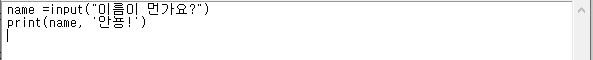


#### 5-1.예제


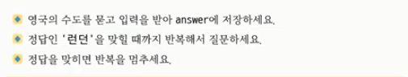

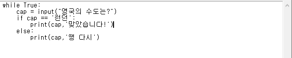


> 끝나질 않네... break를 쓰려고 했는데 생각해보니 않배웠음.. 멀까? 정답은 아래


### 6. continue 와 break


> 설명을 하자면, 카운트에 0이 있다. 그러면 0+1을 하면 1이된다. 그러면 2와 같은가? nop 그래서 그대로 출력이 된다. 그런데 카운트가 1이면 ? 2가 되고 2는 2와 같으니까 continue를 거치게 된다. 그러면 아래에 출력된 결과처럼, 2를 무시하고 다시 와일문으로 돌아가게 된다. 남은 부분은 와일문으로 진행.


> break문 2가되니까 와일문이 멈추게 된다. 그래서 출력이 1만 되는 것.


### 7. 무한 반복하기


```
while True:
	실행할 명령
	
	(컨+C를 하면 무한 반복 끄기)
```


#### 7-1. 예제


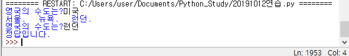


>  음... 내각 생각한 정답. 


> 김왼손님의 정답.


