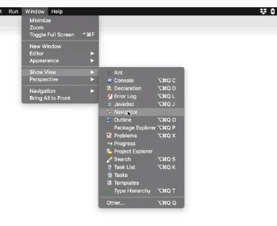
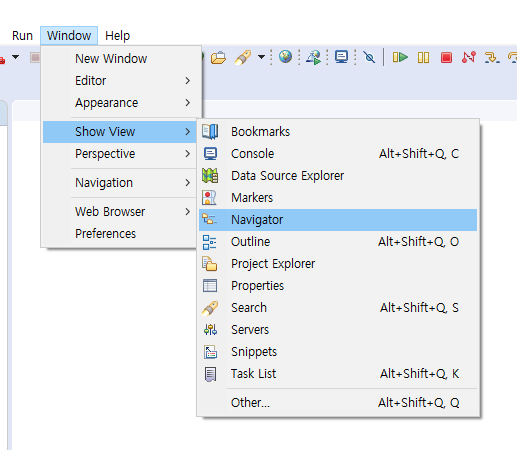
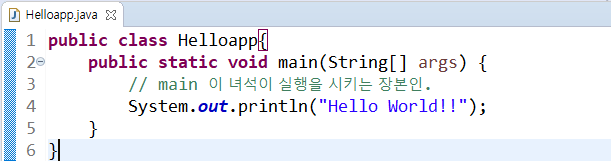
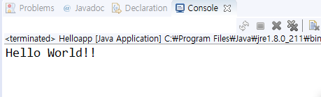
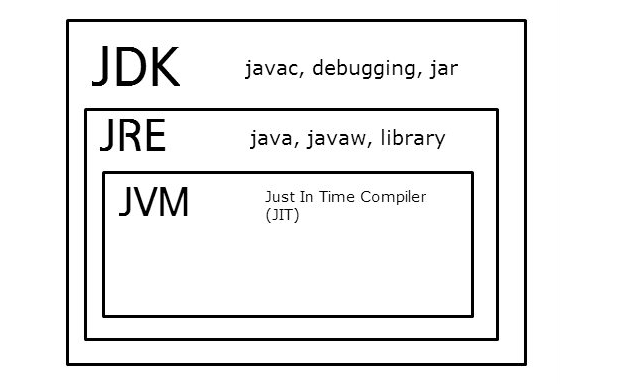
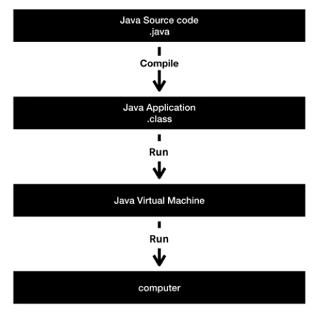

# 20191015 자바 복습 처음부터

> 이번 자바 복습은 생활코딩과 오픈 튜토리얼에서 지원을 해서 시작한 자바야학 3기에서 진행합니다. 코딩에 아무런 지식도 없는 사람들도 시작해도 좋을 정도로, 쉬운 내용을 가지고 자립심을 키우는 과정이라고 보시면 됩니다. 이번 컨텐츠는 자바를 전체적으로 한번 다시 훑어보는 시간이라고 보시면 되겠습니다. 
>
> 그리고 글을 써 나감에 있어서 상당히 길 수도 있다. 이는 초보자 입장에서 쓰는 것 이기 때문이다. 이는 다른 초보자가 어쩌면 고수가 쓴 글보다 더 쉽게 와닿을 수 있을지도 모르겠다. 그래서 최대한 친절하게 글을 쓰려고 노력을 한다. 그리고 모든 내용들을 생활코딩의 영상들을 기초로 하여 쓴 글이므로, 우리 이고잉 선생님께 감사드리자.

### 1. 설정

> 좌측 상단에 패키지 프로젝터가 보일 것이다. 패키지프로젝터도 코딩을 하는 것에는 크게 무리가 없는 환경이다. 허나 윈도우에 네비게이터 혹은 어더즈에 위치한 네비게이터와는 또 다르다. 좀더 불편하지만, 프로젝터에 포함된 전반적인 폴더를 볼 수가 있다. 그래서 고치고 싶은 부분이 있다면 좀 더 딥하게 수정, 보완이 가능한 점이 좋다. 나도 프로젝트를 하면서 패키지 프로젝터에서 헤멘 기억이 있어서 이점은 꼭 고치고 진행을 했으면 좋겠다.

> 아래는 왼도우즈에서 돌아가고 있는 이클립스. 위에는 맥에서 돌아가는 이클립스. 가끔 혼동이 될 때가 있다.

### 2.시작은 역시 Hello World!!!

> 다시 시작되는 역사적인 순간. Hello World!!

### 3. 이론

>  소스,코드,언어 같은 목표를 다른 관점에서 부르는 방법. 그리고 이러한 방법들을 이용해서 만들어 내는 것을 애플리케이션 혹은 프로그램 라고 부른다.  
>
> 아래에 보면 생소한 영어 단어들이 보일 것이다. 너무 어렵게 생각하지는 말자. 그렇기 위해서는 형상화를 하는 것이 좋을 듯하다. 자 우리는 지금 컴퓨터앞에 앉아 있다. 그리고 자바를 이용해서 앱을 만들고 싶다. 그렇다면 일단 컴퓨터의 전원을 킬 것이고, 자바를 다운 받을 것이다. ...100% ! 자. 다운이 완료되었다. 그렇다면 자바를 키면 우리는 아~~~주 기본적인 환경을 갖췄다. 밥먹기 전에 손을 씻고, 밥상 세팅을 하는 것처럼 말이다.
>
> 이제 이클립스를 다운, 실행을 시킨다. 그리고 코드 몇줄을 적어본다.... Hello World? (10 min later) 와우 ~~~!! 된다. 코드를 적고 이를 실행을 시키기 위해서는 컨트롤 + F11 이나 오른쪽 클릭을 하고 run as에서 java application 을 클리해주면 된다. 그리고 이러한 과정을 컴파일 해준다. 라고 알고 있으면된다. 
>
> 초반에 선생님이 해주는 컴퓨터 용어를 못 알아들어서 고생을 좀 했다 ;;;(숨쉬는 것 처럼 참..쉬운건데 ;; 다른 분들은 이런 일이 없으면 좋겠다. 그리고 덧 붙이자면, 많은 분들이 선생님이 있다면 바로 물어보는 경향이 있는 것 같다.(나도 그랬다.)그런데 그전에 꼭 구글링을 한번 해보고 하자. 고생하면서 공부를 하면 더 잘 외워 진다.)  
>
> 잡설은 접고 다시 돌아가자면 컴파일까지 완성을 하면 애플리캐이션을 완성이되고 JVM(java virtual machine)에게 주문을 넣는것이다. 짜...자. 아니 저 코드좀 실행 시켜달라고 말이다. RUNNNNN~~~ 

> 위는 생활 코딩에서 가지고 와 보았고, 아래는 자바야학의 과정을 가지고 와보았다. 위에서 설명한 과정을 이렇게 나타낸 것이다. 코딩을 짜고 진행하는 과정 이라고 생각하면 된다. 오늘은 이만 !!

