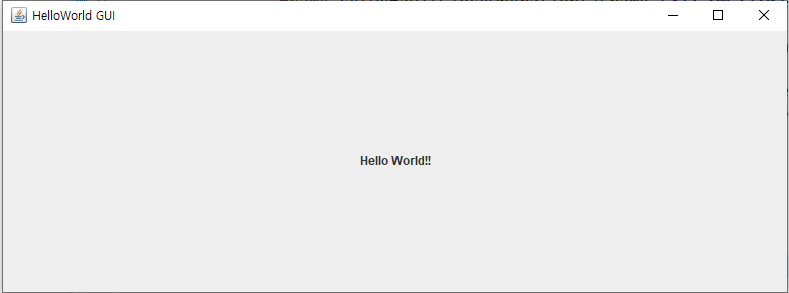
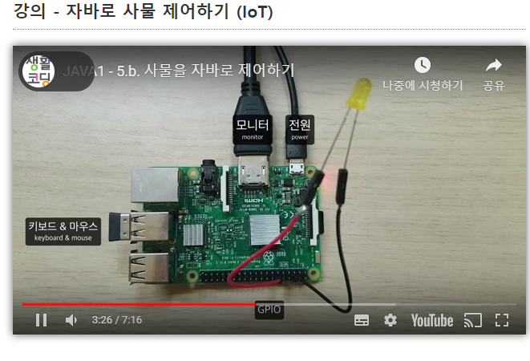
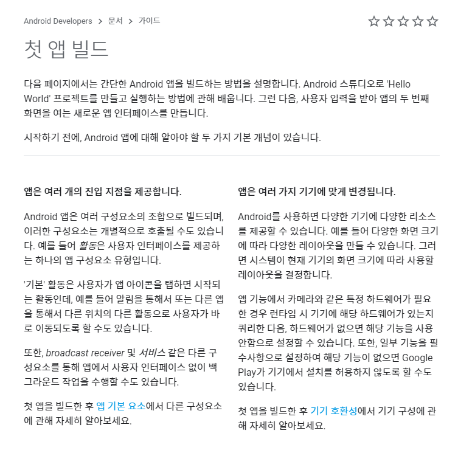

# 20191019 생활코딩 - 자바야햑 - 자바기술응용


### 1.데스크탑 앱 예제


```java
import javax.swing.*;   
import java.awt.Dimension;
import java.awt.Toolkit;
public class HelloWorldGUIApp{
    public static void main(String[] args){
        javax.swing.SwingUtilities.invokeLater(new Runnable() {
            public void run() {
                JFrame frame = new JFrame("HelloWorld GUI");
                frame.setDefaultCloseOperation(JFrame.EXIT_ON_CLOSE);
                frame.setPreferredSize(new Dimension(800, 300));
                JLabel label = new JLabel("Hello World!!", SwingConstants.CENTER);
                frame.getContentPane().add(label);
                Dimension dim = Toolkit.getDefaultToolkit().getScreenSize();
                frame.setLocation(dim.width/2-400/2, dim.height/2-300/2);

                frame.pack();
                frame.setVisible(true);
            }
        });
    }
}
```


> 실행을 하면 아래의 이미지가 출력이 된다. 위의 코드를 이용해서 CENTER값을 조정해 보거나, setLocation의 옵션값들을 이리 저리 바꾸면서 가지고 놀아봅시다.





### 2. IOT 자바로 사물 제어하기


> 컴퓨터가 점점 싸지고, 빨라지고, 작아진다. 이로인해서 우리가 만든 프로그램을 어떠한 사물에넣어주면 프로그램으로 운영이 되는 사물로 바뀌게 된다.  이러한 방식이 "사물이 인터넷에 연결되어 제어된다" = 사물 인터넷(Internet of Things) 라고 불려진다.
>
> 이로 인해서 우리는 지구 반대편에 있는 집에 불을 키거나, 직장에서 집에 물을 줄 수도 있다. 





#### 3. 자바로 안드로이드 앱 만들기


> https://developer.android.com/docs





