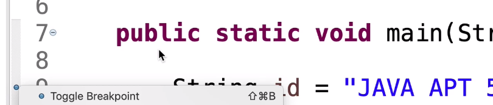
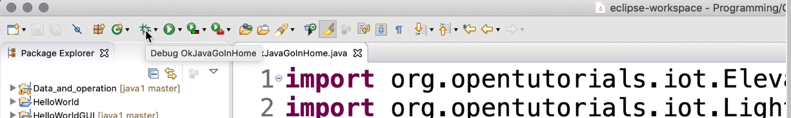
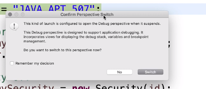
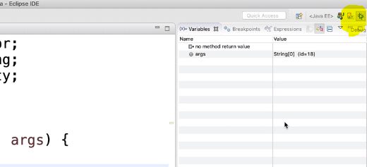
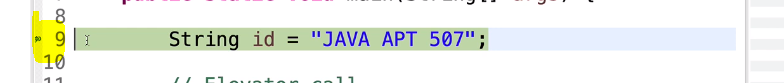
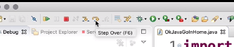
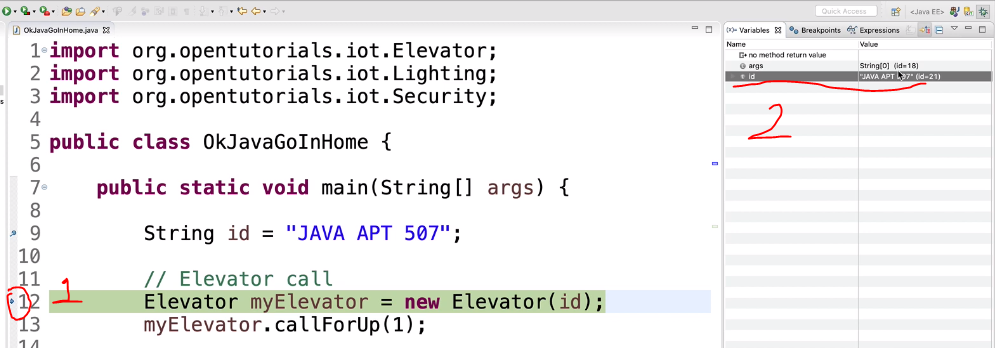

# 20191020 - 자바야학 - 디버거

### 1.디버거

**bug**는 우리가 예상치 못한 문제를 말한다. 그런 **바거를** 잡는 행위를 **debugging** 이라혹 한다. 그리고 이런 디버깅을 하는 녀석을 **debuger **라고 부른다.

### 2. 어떻게 하나?

숫자 옆에 있는 빈칸에 더블 클릭을 하면 Breakporint라는 녀석이 생겨난다.

벌레 모양이 디버거를 뜻한다. 그리고 클릭을 해주면 디버거가 실행이 된다.

퍼스펙티브를 바꿀건지 물어보고 Switch해주면 

저 노랑색부분의 디버거 표시가 클린 된채로 변한다. 그리고 화면의 구성 또한 바뀌는 것을 알 수 있다.

노랑색 부분의 우리가 설정한 브레이크 포인트가 화살표로 바뀌는 것을 볼 수 있다.

그리고 이 때 상위에도 보면 Step Over버튼이 있다. 이 버튼을 클릭을 해주면 하나만 실행이 된다.

스텝 오버를 실행하게 되면 두 가지가 변하게 된다. 첫 번째로 브레이크 포인트가 하나 더 생기는 것을 확인할 수 가 있다. 두 번째로 우측에 id 에 Java apt 507로 세팅이 된 것을 확인할 수 있다.

그리고 몇줄 정도는 뛰어넘고 싶다면 수동으로 처음에 했던 break point 를 생성해주는 것과 같이 수동으로 설정을 해주면 그 앞줄에 있는 코드를 뛰어 넘어서 진행 된다.

가끔은 결과가 어떤 원인으로 찍히는지 궁금 할 수가 있다. 그러면 스텝 오버를 한번 클릭하고 옆에 있는 Step into 클릭하면 나오게 됩니다. 

> 즉, 디버거를 사용한다면, 한줄 한줄 실행 할 수 있다. 그래서 어떤 식으로 진행이 되는 지 확인이 가능한 것이다.  항상 학원에서 코딩을 하고 나면 이.. 과정을 찾느라 헤메다가 엄청난 시간을 허비하게 된다. 이러한 기능을 이용을 해서 효율적으로 공부를 해야 겠다.

