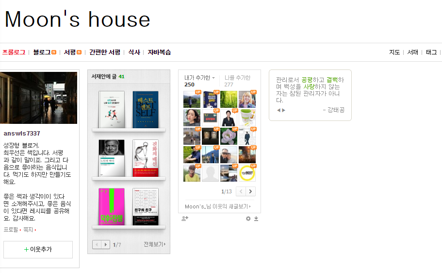
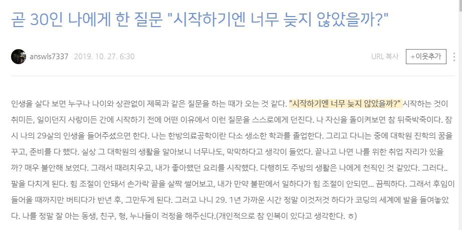

# 20191106 파이썬 Flask 를 들어가기에 앞서서 


> Spring MVC 구조로 만들게되면 많은 시간이 걸릴 것을, 파이썬을 이용한 장고로 만들게 되면 더 짧은 시간내에 만들 수 있다고 한다. 


### 웹과 인터넷의 차이?


**인터넷**: 컴퓨터가 서로 연결되어 통신을 주고받는 컴퓨터끼리의 네트워크.

**웹**: 인터넷상에 정보가 얽혀있는 무형의 정보 네트워크. 

> https://seunghyun90.tistory.com/40  


### Get과 Post의 차이

get 방식과 post 방식은 웹 개발에 주로 이용되는 메서드들이다. 사용자가 URL을 브라우저 주소창에 입력을 하면, 보고싶은 웹 사이트혹은 웹 페이지가 보여지게 된다. 사용자는 그저 단순하게 정보를 읽기 위해서 웹에 요청을 하지만, 이를 처리하기 위해서 웹페이지..내부(내부는 어디지?)에서 어떠한 처리를 하게 된다. 

그래서 우리(클라이언트)들이 웹 사이트에서 페이지를 보려고 하는 것을  **요청**이라고 부르고 서버가 클라이언트의 요청에 답하는 것을 **응답**이라고 한다. 


**그렇다면 GET 방식은 무엇일까?**  클라이언트의 데이터를 URL뒤에 붙여서 보낸다. 위에서 쓴 예시처럼 아이디 패스워드를 보낸다고 하면, www.example.com?id=mommoo&pass=1234 (예시로 쓴 URL입니다. 존재하지 않습니다.) 이런식으로 보낸다. URL 뒤에 "?" 마크를 통해 URL의 끝을 알리면서, 데이터 표현의 시작점을 알린다. 데이터는 key 와 value 쌍으로 넣어야 한다 윗 예시에서의 key는 id 랑 pass고 value는 mommoo랑 1234가 되겠다. 중간에 &마크는 구분자 이다. 2개이상의 key - value 쌍 데이터를 보낼때는 &마크로 구분해준다. URL에 붙이므로, HTTP패킷( 클라이언트가 서버로 요청을 했을때, 보내는 데이터)의 해더에 포함되여 서버에 요청한다. 따라서, GET 방식에서 BODY에 특별한 내용을 넣을 것이 없으므로 BODY가 빈상태로 보내진다. 그러므로, 헤더의 내용중 BODY 데이터를 설명하는 Content-Type이라는 헤더필드는 들어가지 않는다. URL형태로 표현되므로, 특정 페이지를 다른사람 에게 접속하게 할 수 있다.  또한 간단한 데이터를 넣도록 설계되어, 데이터를 보내는 양의 한계가 있다.


이번에는 **POST방식을 알아보자.**POST 방식은 GET 방식과 달리, 데이터 전송을 기반으로 한 요청 메서드이다. GET방식은 URL에 데이터를 붙여서 보내는 반면, POST방식은 URL에 붙여서 보내지 않고 BODY에다가 데이터를 넣어서 보낸다. 따라서, 헤더필드중 BODY의 데이터를 설명하는 Content-Type이라는 헤더 필드가 들어가고 어떤 데이터 타입인지 명시한다. 컨텐츠 타입으로는 여러가지가 있지만, 몇가지를 적자면,


1. **application/x-www-form-urlencoded**
2. **text/plain**
3. **multipart/form-data**


등이 있다. 따라서 POST 방식으로 데이터를 보낼때는 위와 같이 컨텐츠 타입을 꼭 명시해줘야한다. 보통 작성하지 않는 경우는 1번의 컨텐츠 타입으로 셋팅된다. 1번의 컨텐츠 타입은, GET방식과 마찬가지로 BODY에 key 와 value 쌍으로 데이터를 넣는다. 똑같이 구분자 &를 쓴다. 2번의 컨텐츠 타입은, BODY에 단순 txt를 넣는다. 3번의 컨텐츠 타입은, 파일전송을 할때 많이 쓰는데 BODY의 데이터를 바이너리 데이터로 넣는다는걸 알려준다. 자바와 같이 oop(Object Oriented Programming: 객체 지향) 프로그래밍에서는 BODY에 데이터를 InputStream/OutputStream 클래스를 통해서 읽고/쓰고 한다.

출처: https://mommoo.tistory.com/60

## Static Web

: 클라이언트가 서버에 요청을 하게되면, 서버에 미리 저장된 파일이 그대로 전달되는 웹페이지를 말한다. 서버는 사용자가 요청에 해당하는 저장된 웹 페이지를 보내게 되는데, 사용자는 서버에 저장된 데이터가 변경되지 않는 한 고정된 웹페이지를 보게 된다.


## Dynamic Web

: 서버에 있는 데이터들을 스크립트에 의해 가공처리한 후 생성되어 전달되는 웹 페이지를 말한다. 서버는 사용자의 요청을 해석하여 데이터를 가공한 후 생성되는 웹페이지를 보내게 된다. 사용자는 상황, 시간, 요청등에 따라 달라지는 웹 페이지를 보게 될 것이다.


> 정적,동적 웹페이지 참고: https://titus94.tistory.com/4

### PHP

서버 측에서 실행되는 프로그래밍 언어로 HTML을 프로그래밍적으로 생성해주고, 데이터베이스와 상호작용 하면서 데이터를 저장하고, 표현합니다. PHP는 웹을 위해서 만들어졌고, 지금도 웹을 위해서 발전하고 있는 웹을 위한 언어입니다. 웹프로그래밍을 위한 높은 생산성을 제공하는 언어입니다. 특히 서버에 직접 설치해서 운영할 수 있는 설치형 웹에플리케이션(제로보드,텍스트큐브,워드프래스,PHPBB등)의 과반이 PHP로 만들어졌습니다. 따라서 PHP를 배워두시면 이러한 솔루션들에 대한 운영, 문제해결 능력이 향상됩니다.  

위의 설명을 읽다보니 또 HTML과 차이점이 궁금해졌다. 두개의 차이는 PHP는 서버에서 해석이 되고, HTML은 브라우저에서 해석이 된다는 것.

> 출처: https://opentutorials.org/index.php/course/62

### IP 주소

IP 주소는 Internet Protocol address의 약자로서, 컴퓨터 네트워크에서 장치를 서로 인식하고 통신을 하기 위해서 사용하는 특수한 번호입니다. 이 번호를 이용하여 발신자를 대신하여 메시지가 전송되고 수신자를 향하여 예정된 목적지로 전달됩니다. 

### DNS

DNS는 Domain Name System의 약자로서, 호스트의 도메인 이름을 호스트의 네트워크 주소로 바꾸거나 그 반대의 변환을 수행할 수 있도록 하기 위해 개발되었다.특정 컴퓨터(또는 네트워크로 연결된 임의의 장치)의 주소를 찾기 위해, 사람이 이해하기 쉬운 도메인 이름을 숫자로 된 식별 번호(IP 주소)로 변환해 준다. 도메인 네임 시스템을 쉽게 생각을 하자며느 "전화번호부"라고 생각을 하면 좋을 것 같다.


> IP, DNS 출처: https://ko.wikipedia.org/wiki


### URI

url를 풀어서 쓰면, Uniform Resource Identifier 이다. 균일하된 자원 식별자라고 해석이 되는데, 이것이 뜻하는 것은 인터넷에서 구별되어야 하는 곳은 주소창이고 그러한 구분된 식별자를 통해서 인터넷 사용자는 운하는 곳으로 접속이 가능하다. **즉, 특정 사이트를 접속하기 위해서 인터넷 주소창에 적는 문자열은 모두 URL라고 생각하면 된다.**

### URL

URL을 풀어서 쓰면,  Uniform Resource Locator이다. 균일화 된 자원 위치라는 뜻을 가지고 있는 이녀석은 언듯 보아서는 URI와 상당히 비슷하다고 생각할 수 있다. 하지만 차이점이 존재한다. **URL은 인터넷에 접속할 때, 네트워크 상에서 해당 자원이 어디 있는지를 알려주는 문자열이다.** 하지만 이러한 뜻을 자세히 뜯어 보면, 자원의 위치라는 힌트를 생각해보면 결국은 '하나의 파일 위치'라는 것을 말한다. 나의 블로그를 이용해서 보자.


URI : https://blog.naver.com/answls7337



위의 URI는 나의 블로그의 전체코드를 보여준다고 생각하면 된다. 첫 페이지를 통해서 나의 블로그에 어떤 이야기가 주된 키우더인지, 어떤 사람들과 엮여있는지, 어떤 책을 읽었는지를 대강 볼 수 있다. 반대로 


URL:https://blog.naver.com/answls7337/221689648799



이제 하나의 글을 보고 있다. 이글이 221689648799 이 저장소에 있다는 것을 말하는 문자열이다.


좀 더 간단하게 이를 기억하고 싶다면, URI>URL이라고 기억을 하면 좋을 것 같다.


## HTML(Hyper Text Markup Language) 

**HTML 은 하이퍼텍스트 마크업 언어**(**HyperText Markup Language**, 문화어: 초본문표식달기언어, 하이퍼본문표식달기언어)라는 의미의 웹 페이지를 위한 지배적인 마크업 언어다. HTML은 제목, 단락, 목록 등과 같은 본문을 위한 구조적 의미를 나타내는 것뿐만 아니라 링크, 인용과 그 밖의 항목으로 구조적 문서를 만들 수 있는 방법을 제공한다. 그리고 이미지와 객체를 내장하고 대화형 양식을 생성하는 데 사용될 수 있다. HTML은 웹 페이지 콘텐츠 안의 꺾쇠 괄호에 둘러싸인 "태그"로 되어있는 HTML 요소 형태로 작성한다. HTML은 웹 브라우저와 같은 HTML 처리 장치의 행동에 영향을 주는 자바스크립트와 본문과 그 밖의 항목의 외관과 배치를 정의하는 CSS 같은 스크립트를 포함하거나 불러올 수 있다. HTML과 CSS 표준의 공동 책임자인 W3C는 명확하고 표상적인 마크업을 위하여 CSS의 사용을 권장한다.

> 출처: 위키피디아

### 

### 꿀팁


> !  + tab : 구조 자동 불러옴

```html
<!DOCTYPE html>
<html lang="en">
<head>
    <meta charset="UTF-8">
    <meta name="viewport" content="width=device-width, initial-scale=1.0">
    <meta http-equiv="X-UA-Compatible" content="ie=edge">
    <title>Document</title>
</head>
<body>
    
</body>
</html>
```


> Alt  + B를 하면 바로 브라우저를 켜둔다.


> li * 3  (엠엣 신텍스)
>
> <li>1<li>
>
> <li>2<li>
>
> <li>3<li>


> Alt+Ctrl 을하면 깜지를 빠르게 쓸 수 있다.


> 참고:  https://coding-factory.tistory.com/184 
>
> 웹페이지와 웹사이트의 차이: [https://www.websiteplanet.com/ko/blog/%EC%9B%B9-%EC%82%AC%EC%9D%B4%ED%8A%B8-vs-%EC%9B%B9-%ED%8E%98%EC%9D%B4%EC%A7%80-%EB%AC%B4%EC%97%87%EC%9D%B4-%EB%8B%A4%EB%A5%B8%EA%B0%80%EC%9A%94/](https://www.websiteplanet.com/ko/blog/웹-사이트-vs-웹-페이지-무엇이-다른가요/)


