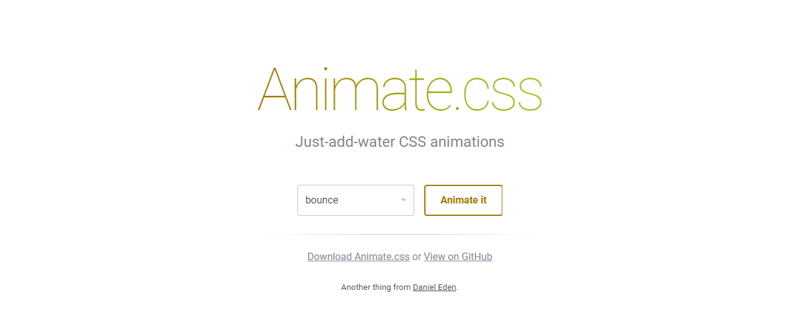
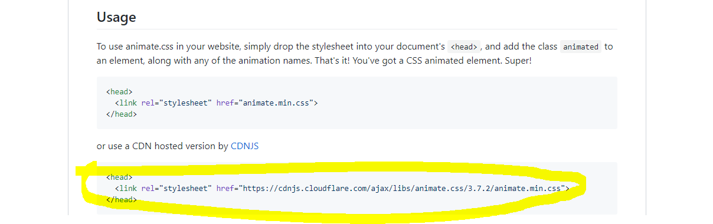
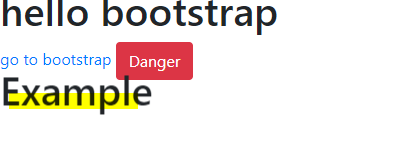
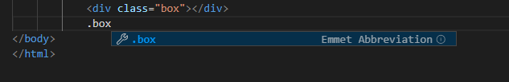

# CSS


**CSS**: html을 꾸며주는 언어


**HTML**: 정부의 구조화 


단위

- em: 배수 단위로 상대 단위이다. 요소에 지정된 사이즈에 상대적인 사이즈를 설정한다.
- rem: r은 root를 의미한다. 기준은 상속의 영향으로 바뀔 수 있다. 즉, 상확에 따라1.2em은 각기 다른 값을 가질 수 있따. rem은 최상위요소(html)의 사이지를 기준으로 삼는다.


Viewport 단위


색상 표현 단위


기본 박스 모델


display 속성

block 모델 : 

inline : span a strong  .....


블럭의 위치


- relative(상대위치)
- absolute(절대위치)
- fixed (고정위치)


## Bootstrap


1. 인터넷에서 bootstrap을 검색 

2. 두가지를 copy&paste를 해줘야 한다.


```html
<link rel="stylesheet" href="https://stackpath.bootstrapcdn.com/bootstrap/4.3.1/css/bootstrap.min.css" integrity="sha384-ggOyR0iXCbMQv3Xipma34MD+dH/1fQ784/j6cY/iJTQUOhcWr7x9JvoRxT2MZw1T" crossorigin="anonymous">

를 해드에서
```

```html
<script src="https://code.jquery.com/jquery-3.3.1.slim.min.js" integrity="sha384-q8i/X+965DzO0rT7abK41JStQIAqVgRVzpbzo5smXKp4YfRvH+8abtTE1Pi6jizo" crossorigin="anonymous"></script>
<script src="https://cdnjs.cloudflare.com/ajax/libs/popper.js/1.14.7/umd/popper.min.js" integrity="sha384-UO2eT0CpHqdSJQ6hJty5KVphtPhzWj9WO1clHTMGa3JDZwrnQq4sF86dIHNDz0W1" crossorigin="anonymous"></script>
<script src="https://stackpath.bootstrapcdn.com/bootstrap/4.3.1/js/bootstrap.min.js" integrity="sha384-JjSmVgyd0p3pXB1rRibZUAYoIIy6OrQ6VrjIEaFf/nJGzIxFDsf4x0xIM+B07jRM" crossorigin="anonymous"></script>

를 바디에서
```


3. 사용가능 !!! 


## Animate.css

>  https://daneden.github.io/animate.css/ 
>
> 요런 사이트가 있다. 참고참고 ~~~~~~~~ 



> 사이트를 방문하면 이렇게 나오게 되는데 이를 사용하기 위해서는 중간에 있는 **View on Github**로 들어가주면 된다. 그러면 깃허브로 넘어가게 되는데요





> 노란색에 있는 부분을 복사해서 head에 붙여넣어주세요. 그러면 사용준비 끝 !!! 구러면 예제를 넣어보면


> 아래로 내려가게 되면 요런 자그마한 예제가 있는데요 이거를 복사를 해서 바디에 붙여넣어주면 




> Example 이 방방 뛰게 된다. (귀엽)


## 꿀팁

> html을 사용시 클래스명을 타이핑하지않고 **.class name** 하게되면 자동 생성하게 된다. 그리고 **#class name**하게 되면 아이디 값으로 생성을 해준다. 끝에는 **tab**을 해주는 것을 잊지말구요~~





