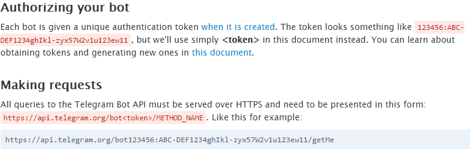

# 20191108


멀 할지는 모르지만

1. 크롬에서 텔레그램을 먼저 인스톨 해준다.
2. 레그렘에서 사용자를 찾는 란에서 botfather를 검색한다.
3. 이름을 설정 해준다.
4. otfather가 우리에게 TOKEN을 준다.
5. Day_3 폴더에서 **.env 파일은 생성한다.** 

6. 

```
TOKEN=Use this token to access the HTTP API:
```

를 넣어준다. 


참고사항 :  https://core.telegram.org/bots/api 




```
https://api.telegram.org/bot<TOKEN>/getMe
```

봇에 대한 설명이 json형식으로 날라온다.

```
https://api.telegram.org/bot<TOKEN>/getUpdates
```

대화를 했던 정보들이 보인다.

대화를 했던 정보에서 ID가 있다 그아이디를 알고 있어야 한다!!!

```
https://api.telegram.org/bot<token>/sendMessage
```

이번에는 메세지를 보는 방법이다. 위에 토큰을 넣고 sendMessage를 넣어준다.

```
https://api.telegram.org/bot<token>/sendMessage?chat_id=num&text=안녕

```

하면?  


&


봇도 안녕이라 해준다.


### webhook server

~~~python
@app.route('/chat')
def chat():
    return render_template('chat.html')

@app.route('/send_msg')
def send_msg():
    req = request.args.get("chat")
    #받을때
    res = requests.get(f'{base_url}/getUpdates').json()
    chat_id = res['result'][0]['message']['chat']['id']

    send_url = f'/sendMessage?chat_id={chat_id}&text={req}'

    response = requests.get(base_url+send_url)
    #보낼때
    return "보내기 완료"
    
@app.route('/',methods=['POST'])
def tel_web():
    
    req = request.get_json().get('message')

    if req is not None:
        chat_id = req.get('chat').get('id')
        text = req.get('text')

    print(chat_id,text)
    return '', 200 


if __name__=="__main__":
    app.run(debug=True)
~~~


### 로또라고 보내면 로또 번호를 받는 실습

```python
@app.route('/',methods=['POST'])
def tel_web():
    
    req = request.get_json().get('message')

    if req is not None:
        chat_id = req.get('chat').get('id')
        text = req.get('text')
    if '로또' == text:
        lotto = random.sample(range(1,47),6)
    else:
        lotto=text

    send_url = f'/sendMessage?chat_id={chat_id}&text={lotto}'
    response = requests.get(base_url+send_url)
```


## 꿀팁


```
pip list 
```

pip 리스트 보여주는 명령어

