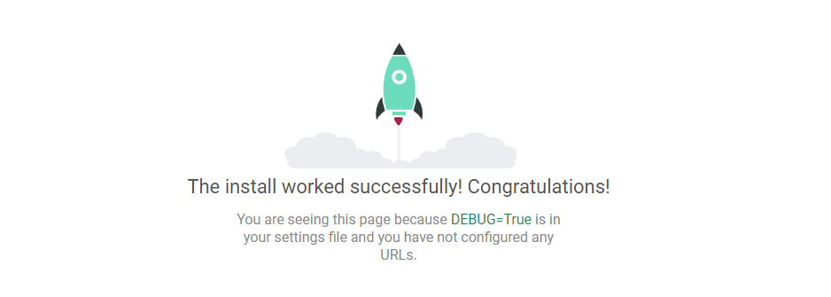
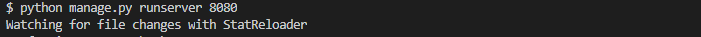
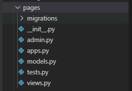
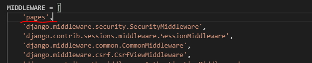

# 20191111 Day_4


## 장고

Django(*/dʒæŋɡoʊ/ jang-goh/쟁고/장고*)는 파이썬으로 만들어진 무료 오픈소스 웹 애플리케이션 프레임워크(web application framework)입니다. 쉽고 빠르게 웹사이트를 개발할 수 있도록 돕는 구성요소로 이루어진 웹 프레임워크랍니다. 


### 작동방식

MTV(model template view) 패턴으로 진행된다. 틀은 MVC와 비슷하다. 예를 들어서 클라이언트가 1번강의를 보기위해서 서버에 요청을 한다. URL을 입력을해서 사이트로 접속을 하면, View(controller) 로 요청을 한다.그러면 model(DB)에게 명령을하고 View로 요청하는 데이터를 넘겨준다. 그러면 view는 이를 다시 Template로 던져주어서 이를 HTML 형식으로 클라이언트에게 보여준다.


오늘은 1차적으로 아래의 순으로 오늘 강의는 진행이 된다.

User -> URL -> View -> Template -> User

>  참고사항:  https://tutorial.djangogirls.org/ko/django/ 


### 기초 설정

```
virtualenv venv
```

환경구성을 위해서 폴더를 만들어주는 단계

```
$ source venv/Scripts/activate
```

까지하고 

```
pip install django 
```

를 해주게 되면 일단 장고의 다운.

```
django-admin startproject config .     
```

그리고 장고 프로젝트를 만들기 위해서 위의 명령어를 진행한다. 마지막에 **space bar .**도 타이핑해야되요 !!!


```python
$ python manage.py runserver

Watching for file changes with StatReloader
Performing system checks...

System check identified no issues (0 silenced).
```


python manage.py runserver 를 명령해주면 서버가 켜지게 되고, 사이트로 들어가게 되면 아래의 이미지를 볼 수 있다.



그리고 위의 명령어로 진행을 하면 디폴트 값으로 8000 포트를 이용을 한다.

****

그런데 만약에 다른 포트를 사용하고 싶다면



위의 이미지와 같이 python manage.py runserver 뒤에 포트 번호를 붙여주면, 저 포트를 사용하게 된다.


## settings.py 알아보기

```
SECRET_KEY = [secret key num]

#보안을 위한 시크릿 키
```


```python
INSTALLED_APPS = [
    #장고에서 기본적으로 사용되는 앱들.
    'django.contrib.admin',
    'django.contrib.auth',
    'django.contrib.contenttypes',
    'django.contrib.sessions',
    'django.contrib.messages',
    'django.contrib.staticfiles',
]

```


```
MIDDLEWARE = [
    'django.middleware.security.SecurityMiddleware',
    'django.contrib.sessions.middleware.SessionMiddleware',
    'django.middleware.common.CommonMiddleware',
    'django.middleware.csrf.CsrfViewMiddleware',
    'django.contrib.auth.middleware.AuthenticationMiddleware',
    'django.contrib.messages.middleware.MessageMiddleware',
    'django.middleware.clickjacking.XFrameOptionsMiddleware',
]

미들웨어: 응용 소프트웨어가 운영 체제로부터 제공받는 서비스 이외에 추가적으로 이용할 수 있는 서비스를 제공하는 컴퓨터 소프트웨어이다. 
```


```python
장고에서 사용되는 시스템 설정
TEMPLATES = [
    {
        'BACKEND': 'django.template.backends.django.DjangoTemplates',
        'DIRS': [],
        'APP_DIRS': True,
        'OPTIONS': {
            'context_processors': [
                'django.template.context_processors.debug',
                'django.template.context_processors.request',
                'django.contrib.auth.context_processors.auth',
                'django.contrib.messages.context_processors.messages',
            ],
        },
```


```
DATABASES = {
    'default': {
        'ENGINE': 'django.db.backends.sqlite3',
        'NAME': os.path.join(BASE_DIR, 'db.sqlite3'),
    }
}

데이터 베이스 설정 가능
참고: docs.djangoproject.com/en/2.2/ref/settings/#databases
```


```
AUTH_PASSWORD_VALIDATORS = [
    {
        'NAME': 'django.contrib.auth.password_validation.UserAttributeSimilarityValidator',
    },
    {
        'NAME': 'django.contrib.auth.password_validation.MinimumLengthValidator',
    },
    {
        'NAME': 'django.contrib.auth.password_validation.CommonPasswordValidator',
    },
    {
        'NAME': 'django.contrib.auth.password_validation.NumericPasswordValidator',
    },
]

패스워드가 부적격한지 어려운지 보는 부분
```


```
LANGUAGE_CODE = 'ko-kr'

TIME_ZONE = 'Asia/Seoul'

USE_I18N = True

USE_L10N = True

USE_TZ = True

```

설정이 위의 이미지 처럼 되어 있는데 아래처럼 한국에서 산다면, 바꿔주면 좋을 것 같다.


### 장고앱 만들기

```
$ python manage.py startapp pages
```


위의 명령어로 만들어주면,





위으 이미지와 같으 만들어준다.





방금 만든 앱을 사용하기 위해서는  settings 에서 미들웨어에서 앱의 이름을 붙여준다.

```
@app.route('/indext') => url.py

///////////////////////////////////////////////////////////////////////////

def index():

​	return render_template('index.html')
```


플라스크에서는 한 파일에서 코드를 구성했던 것인데, 장고에서는 저렇게 다른 파일에서 관리를 해준다고 한다.


url패턴 어떤 행동을 할 지.


```
@app.route('/indext/<int:num>') => url.py

///////////////////////////////////////////////////////////////////////////

def index():

​	return render_template('index.html')
```


int : 0또는 양의 정수와 매치

str : / 를 제외한 모든 문자열과 매치,디폴트값

slug : slug 형식 (아세끼코드, 숫자 하이픈, 밑줄)과 매치

uuid : uuid 형식의 문자열과 매치

ex)  UUID(Universally Unique Identifier, UUID)


url 에서 패스를 먼저 설정응ㄹ 하고, View 에 가서 설정을 하고, Templates에서 html 을 만들어주어서 진행


#### 실습1

숫자를 받아서 페이지 n 제곱 값을 나타내보자.


위의 방식을 코드로 하면 되는데......

1. ```python
   urlpatterns = [
         path('<int:Squared>/',views.Squared),
   ]
   ```

2. ```python
   
   def Squared(request, Squared):
       return render(request, 'Squared.html',{'num':Squared**2})
   ```

3. ```html
   <h1>Squared</h1>
   <p>{{ num }}</p>
   ```

4. 

   

faker 라이브러리

: 미리 저장된 URL중 아무 것이나 클라이언트에 보여주는 라이브러리

```
 pip install faker
```

하게 되면 인스톨이 완성.


#### 그외 오늘 한 것

```python
from django.shortcuts import render
from django.http import HttpResponse
import random
import re
from faker import Faker 
from datetime  import datetime


# Create your views here.

# MVC 구조에서 C를 맡고 장고에서는 MVT 구조에서는 V를 맡고 있다. 
# 가장 많은 수정을 거칠 것으로 예상

def index(request):
    #장고는 인덱스 갈호안에 아무젃도 없었는데 장고는 request가 필요
    #return HttpResponse("Hello Django")
    return render(request,'index.html')

# def age(request, age):
#     # 주소의 인자값은 ..
#     # context ={'age':age} 
#     return render(request,'age.html',{'age':age})

def Squared(request, Squared):
    return render(request, 'Squared.html',{'num':Squared**2})

def cal(request, num1, num2):
    context ={
        'num1' : num1,
        'num2' : num2,
        'cal' : num1 + num2
    }
    return render(request, 'plus.html', context)

def profile(request,name,age):
    print(type(name))
    context ={
        'name':name,
        'age':age
    }
    return render(request,'profile.html',context)

def indian(request,name):

    indianname=['집념의 사나이','물을 뿝는 돼지','노망난 아가씨','저리가라 마녀','내가 제일 잘났어 쥐새끼','바지에 똥싼 20대 중반 남성']
    context = {
        'name':name,
        'indianname1': random.choice(indianname)
        }
    return render(request,'indian.html',context)

def lotto(request):
    num = random.sample(range(1,47),6)
    context = {
        'lotto_num':re.sub('\[]','',num)
        #lotto.sort()
        # L_num=[str(I) for I in lotto]
        #context = {
        #   'name':name,
        #   'age': age,
        #   'i_name' : i_name,
        #   'lotto':","
        # }
    }
    return render(request,'lotto.html',context)

def job(request,name):

    fake =Faker('ko_kr')
    job=fake.job()

    context ={
        'name':name,
        'job' : job
    }
    return render(request,'faker_job.html',context)

def image(request):
    num=random.choice(range(1,50))
    url=f"https://picsum.photos/id/{num}/200/300"

    context = {
        'url':url
    }

    return render(request,'image.html',context)
def dtl(request):
    foods = ["짜장면","탕수육","짬뿡","군만두","고추잡채","볶음밥"]
    my_sentence = 'life is hsort, you need python.'
    messages = ['app;e','banna','cucumber','mango']
    timenow = datetime.now() 
    empty_list = []

    context = {

        "foods": foods,
        "my_sentence" : my_sentence,
        "messages":messages,
        "empty_list":empty_list,
        'timenow': timenow
    }
    return render(request,'dtl.html',context)

def birthday(request):
    timenow = datetime.now()
    birth = datetime(2020,7,22)

    d_day = (timenow - birth).days
    #print(today.month)
    if timenow.month == 6 and timenow.date == 22:
        res =  True
    else:
        res = False


    context = {
        'result':res,
        'd_day':d_day
    }   
    # }

    # birthday = ['1991/06/22']

    # context = {
    #     "timenow":timenow,
    #     "birthday":birthday
    # }
    
    return render(request,'birthday.html',context)

```


## QQ

DNS 리바인딩??


## 꿀팁

- 틀린것 있으면 이전에 타이핑한 코드를 역경로로 추적해서 주석처리하면서 오타 찾아보기.

