## form

- form : action 데이타가 전송될 url method -GET/POST
- input : name: key/ value: value
- label: for옵션 input 에 id값이랑 매치
- 정보를 담아 서버에 보내는 역할을 한다.


## GET

- data 가 body 통한게 아니라 쿼리스트링
- data가 body를 통한게 아니라 QueryString
- 데이터를 조회할 때

 

> 예제에 들어가기에 앞서서 맨날 사용했던 가상환경에 대해서 잠시 알아보고 진행을 하려 한다. 


### Python 가상환경 

파이썬에서는 한 라이브러리에 대해서 하나의 버전만 설치가 가능하다고 합니다. 그래서 만약 여러 가상환경이 필요하다면, 프로젝트 또한 여러개를 만들어서 진행을 하면 됩니다. 그래서 각각의 가상환경은 독립된 공간에서 제공이 됩니다. 가상 환경은 총 3가지가 있습니다. venv, virtualenv, 마지막으로 pyenv가 있습니다. 그 중 제가 배운 것은 virtualenv이기 때문에 이것만 좀 더 설명을 해볼까 합니다.


### virtualenv

일단 인스톨을 먼저 시켜야 겠죠.

 ```python
pip install virtualenv
 ```

**다음으로는 virtualenv로 가상환경을 생성하겠습니다.**

``` python
virtualenv 가상환경
```

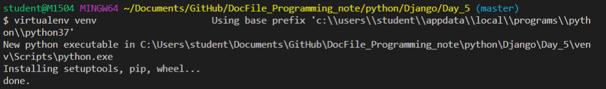

가상환경을 구동하게 됩니다.

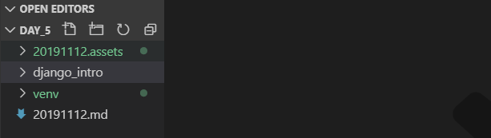

venv 폴더가 생성이 되었습니다.


```
가상환경명/bin/activate
```

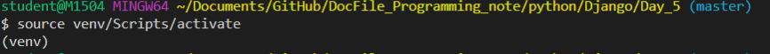

 이미지와 위에 코드를 보면 경로가 다른데요. venv에 들어가니까 bin 폴더가 없는 것을 확인하고, Scripts에  activate가 있어서 경로를 바꿨습니다. 여러분도 확인해 보세요!!!


### 예제 시작


아래부터는 GET방식으로 진행하는 장고 예제입니다.

먼저 설정부터 ~~~~~~~~~~~~~~~~ LeGo~

```
$ django-admin startproject config .
```

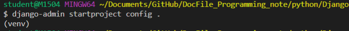

위와 같은 코드를 치게되면, config폴더가 생성이 됩니다.


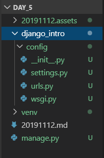


다음우로는 Settings.py 를 건드려 보겠습니다. 먼저,


앱스에서 만들 app의 이름을 추가해 줍니다. pages 그리고 아래로 내려가 보시면 시간과 언어를 설정하는 부분이 있습니다.


```
LANGUAGE_CODE = 'ko-kr'

TIME_ZONE = 'Asia/Seoul'
```


위의 설정으로 바꿔주시고요 ~ 

여기서 하다가 문제가 있었는데, 저는 이전에 장고를 한적이 있어서 그런지 django-admin이 문제없이 진행이 되었다. 그런데 장고가 없다.


그래서 일단 장고 먼저 다운 !!!

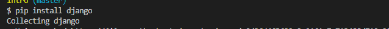

장고 인스톨 이후에 pages app을 생성

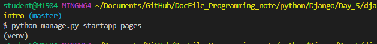

이제 apps에서 설정했던 pages 폴더를 말들기 위해서 위와 같은 명령어를 타이핑합니다. 참고로 이전에 만들었떤 django_intro 폴더 안에서 생성을 했습니다. 그렇지 않으면 에러가 아래와 같이 벙~하고 뜨니 주의해주세요.

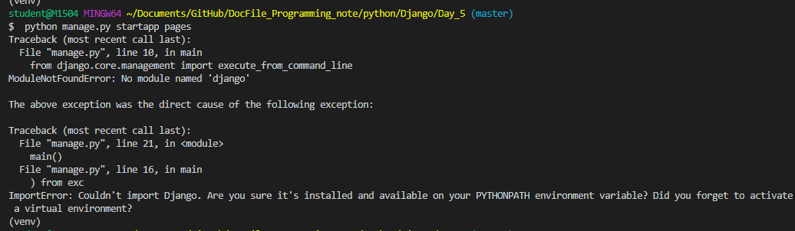 

 manage.py에 있는 코드들이 에러가 나면서 뜨네요.  위의 에러가 나지않고 진행이 잘 되었다면, 아래와 같이 폴더가 구성이 될 것 입니다.

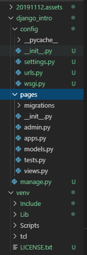


### urls.py

```python
from django.contrib import admin
from django.urls import path
from pages import views

urlpatterns = [
    path('admin/', admin.site.urls), 	->>1
    path('throw/', views.throw), 		->>2
    path('catch/' , views.catch), 		->>3
]
```


위의 코드를 url.py에 타이핑을 하게 됩니다. url.py를 할 때 주의해야 할 점은 **위에서 아래 순으로 진행을 해야 합니다.** 왜냐하면, 순서대로 진행을 해주어야 나중에 유지 보수를 할 때 편하기 때문이라고 하시네요. 

**두 번째로 path경로를 정해주시고 끝에는 쉼표 , 를 넣어주세요.** 마지막 문장이라면 그렇게 안하셔도 에러는 나지는 않지만, 다음에 path를 할 때, 까먹고 안하면 에러가 나는 것을 방지하기 위해서 입니다. 


### view.py

```python
def throw(request):
    return render(request,'pages/throw.html')
def catch(request):
    pprint(request)
    pprint(request.path)
    pprint(request.method)
    pprint(request.META)

    return render(request, 'pages/catch.html')

# Create your views here.

```

를 위와 같이 고치고 마지막으로 pages에 있는 html파일을 손 보자.


### throw.html / catch.html

```python
  
<form action="/pages/catch/" method = "GET"><!--submit 했을때 어떤 장소로 보낼지 목적지-->
    <label for="msg"></label>
    <input type="text" name = "message" id="msg"> <!--for와 id가 매치가 알아 서 될 것 이다.-->
    <input type="text" name = "message2" id="msg2"> <!--for와 id가 매치가 알아 서 될 것 이다.-->
    <input type="submit" >
</form>
```

```python
<h1>받을 내용 : {{ msg }}, {{ msg2 }}</h1>
```


### <결과>

```
.
.
.
.
timezone = get_current_timezone()
  File "C:\Users\student\Documents\GitHub\DocFile_Programming_note\python\Django\Day_5\venv\lib\site-packages\django\utils\timezone.py", line 97, in
in get_current_timezone
    return getattr(_active, "value", get_default_timezone())
  File "C:\Users\student\Documents\GitHub\DocFile_Programming_note\python\Django\Day_5\venv\lib\site-packages\django\utils\timezone.py", line 83, in
in get_default_timezone
    return pytz.timezone(settings.TIME_ZONE)
  File "C:\Users\student\Documents\GitHub\DocFile_Programming_note\python\Django\Day_5\venv\lib\site-packages\pytz\__init__.py", line 181, in timezozone
  
  ???? 에러가 나네??? 왜지?? 내일 물어봐야겟다.
```

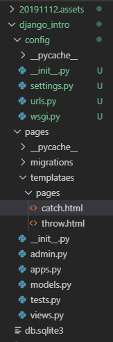

> 현재 MVT 구조는 이전 날에서 다뤘기에 거기서 참고를 하면 좋을 것 같다. 또한 지금까지 배운 장고에서 위와같은 구조가 바뀌지 않으므로 앞으로 이 사진은 붙지 않을 예정이다.


Post

- 디비를 생성/변경 할때 주로 사용하고 html body 정보를 담아 전송
- 원칙적으로 POST요청은 html 파일로 응답하면 안됨
  - post 요청이 오면get 요청 받는 페이지로 redirect(RESTful)
- django는 post 데이터를 그냥 보내지 않는다.
  - csrf_token
  - Cross Site Request Forgert
  - 토큰을 보내지 않으면 403에러가 나온다.


템플릿 상속

1. TEMPLATES 설정 안에 

DIRS : [os.path.join (BASE_DIR,"프로젝트 셋팅즈있는 폴더 명","templates")]


2. 프로젝트 셋팅즈 폴도명/templates/base.html 작성을 합니다.
3.  을 html 파일안 원하는 곳에 둔다. 
4. 만들어진 base.html 을 상속하려면 html  상단에   내용을 기술하면 됨. 


## 꿀팁


### Snippet

: 이거 완전 꿀팁입니다. file에서 preferences 에 user snippets가 나옵니다.


user snippets를 클릭해주면, 아래와 같이 나오게 되고 여기서 html을 타이핑 그리고 엔터를 해 줍니다.


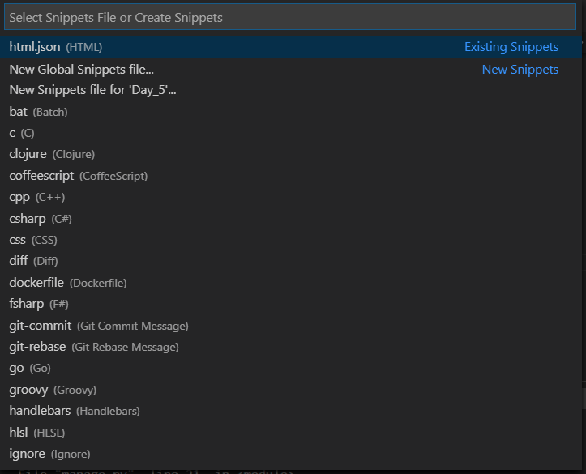


그러면 아래와 같은 이미지의 html.json 파일이 생성이 된다. 

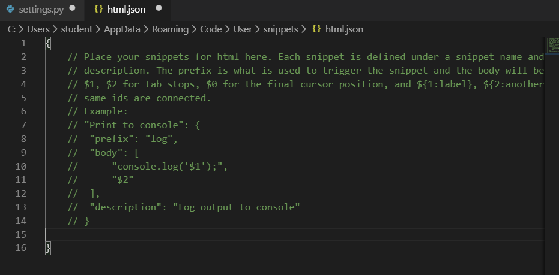


그리고 {   } 안에 코드를 써준다.

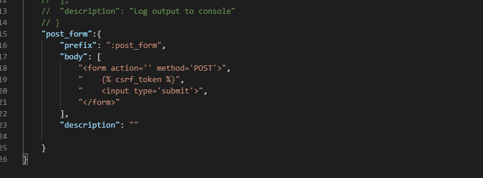


이렇게 써주면, form이라고 타이핑을 하고 tab을 누르면 자동완성이 되는 것이 된다.  그리고 이것을 에밋이라고 부른다. 잘만 쓰면 기본 구조를 짜는 단계의 시간을 많이 절약 할 수 있을 것 같다.


## QQ

- urls.py 에서 왜 순서대로 쓰는가?
- lotto_num.append(random.sample) 코드를 이용해서 샘플을 하나 얻을 때, 중복이 되는 경우는없느낙?