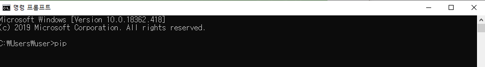
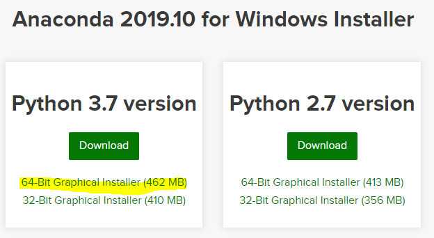
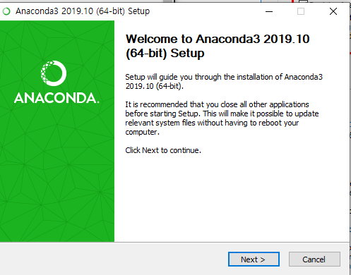
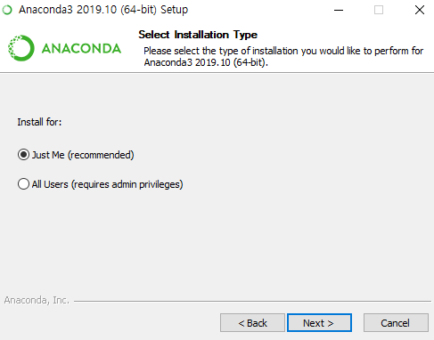
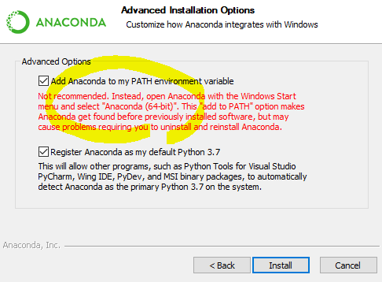
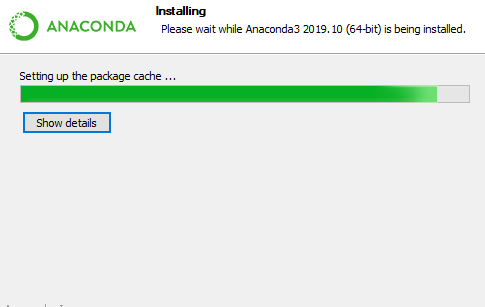
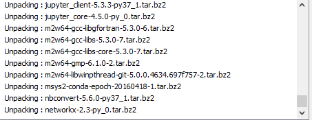
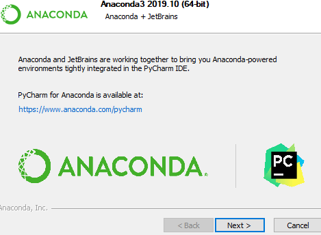

> 현재 MIT에서 무료로 진행하는  Electrical Engineering and Computer Science 를 듣고 있다. 누구에게나 개방이 되어 있어서 참으로 좋다. 단점은, 이전에 2007년도 강의들과는 다르게 한국어 번역이 안된다. 이 점만 유의해서 들으면 좋을 것같다.
>
> 아나콘다는 위의 과정에서 추천하는 이클립스같은 존재인 것 같다. 파이썬으로 할 경우 

 

> 위와 같이 CMD 창에서 PIP install 을 연신 타이핑을 쳐줘야하고, 때로는 이도 되지않아서 빌드하는 것에만 꽤나 많은 시간을 쏟을 때가 있었다. 이 기회에 한번 아나콘다를 사용해 보자. 그래서 이번 글은 아나콘다를 다운 받는 것 부터 시작한다.

>  아나콘다 사이트 먼저 GO ~
>
> https://www.anaconda.com/distribution/

> 파이썬을 3.7버전으로 받았고, 컴퓨터가 64비트니까 당연히 저렇게 다운로드를 하겠죠. 가끔 코딩 중에 2.7버전에서만 되는 것들이 있기에 필요에 따라서 진행하면 되겠죠?

> 아직까지는 NEXT 클릭 ~~~

> 경로를 더해준다. 아직 나도 초보이기에 어떤 코드를 짜다가 에러가 났는지 명확하게 기억이 나지 않는다. 하지만 저거 PATH를 클릭해주지 않아서 파이썬을 다시 다운로드 했던 기억이 있다. 다들 저거는 클릭 합시다. 왜냐하면 저렇게 PATH를 설정해 두면 따로 설정없이, 명평프롬프트(CMD)에서 혹은 파워 쉘에서 아나콘다를 바로 실행을 할 수 있기 때문입니다.(구글링 ~ )

> 멀이렇게 오래걸리나 해서 Show details를 눌러보니... 와... 패키지를 다 다운받고 있네 ㄷㄷㄷ ㅇㅈ합니다.

아.. 그냥 디폴트하듯이 그냥.. 막눌러서 Finish는 없네.. 오늘은 여기까지 ~~~