# 20191013 파이썬 53~70강

> 요약한 영상 : 한입에 쏙 파이썬 https://www.youtube.com/watch?v=suBE-ZBaOds&list=PLGPF8gvWLYyontH0PECIUFFUdvATXWQEL&index=41


### 1. 튜플 기본구조 

> 리스트와 같은 일을 한다고 생각하면 된다. 한 가지 다른 점이 있다면, 튜플은 수정이 불가능 하다.

~~~
(값1, 값N .....)

#리스트와는 다르게 ()로 처리한다.
~~~


> 1번은 빈 튜플을 만들었다.
>
> 2번은 숫자로 만들어진 튜플
>
> 3번은 소가로없는 튜플 거기에 문자열까지 !!
>
> 아래에 나올 예제는 튜플이라는 타입을 어떻게 나타낼 수 있는가? 에 대해서 표현하려고 하는 예제이다. 첫 번째 예제는 타입이 정수 타입으로 출력이 된다. 두번째 코드는 타입이 튜플로 나온다. 첫 번째는 그저 1 하나만 만 써주었기 때문에 출력이 정수형으로 되었고, 두 번째는 1 다음에 **,** 를 써주었기 때문에 튜플형식으로 나온다. 만약 정수를 1개만 써준다면 유의해야한다.(세번째 네번째는 괄호없으면 어떻게되나? 궁금해서 써봄.)


### 2.  값 가져오기

> 리스트와 마찬가지로 인덱스로 가지고 오면된다


~~~
듀플[접근할 인덱스]
~~~


### 3. 패킹과 언패킹


> 여러개의 값을 하나의 변수에 넣는거를 패킹/ 패킹되어져 있는 것을 여러개의 변수에 풀어주는 것을 언패킹.
>
> 쉽게 생각을 해서 패킹은 묶는것, 언패킹은 푸는것.


> 클로버는 패킹, 클로 넘은 언패킹을 한 것. 
>
> 패킹을 하게되면 타입이 튜플이고 언패킹은 튜플도 되고 변수에 입력된 것에 따라 튜플도 혹은 다른 타입도 가능하다.


#### 예제


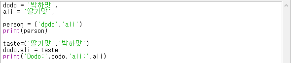


### 4.딕셔너리 기본구조

> 키가 있고 거기에 대응하는 값이 있다. 

```
{키1:값1 ,키N : 값N.....}
```


### 5. 딕셔너리에 값 추가하기

```
딕셔너리[추가할 키] = 추가할 값
```

> 딕셔너리에 값을 추가하는 방법이다. 그런데 만약 키안에 값이 있다면, 추가하는 값이 기존 값을 대체하게 된다.


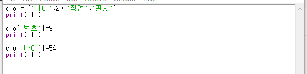


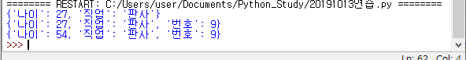


> 일단 딕셔너리구조로 clo에 저장을 했다. 그리고 새로운 키와 값을 추가를 해보고, 이번에는 나이의 값을 바꾸는 예제를 해보았다. 


### 6. 값에 접근하기

```
딕셔너리[접근할 키]

: 딕셔너리는 키로 접근한다. 그런데 만약 존재하지 않는 키를 가지고 오려하면, 에러가 난다.

딕셔너리.get(접근할 키)

: 그래서 위의 오류를 위해서, 키가 존재하지 않더라도, 에러가 나지는 않고 아무 값도 주지 않는다.
```


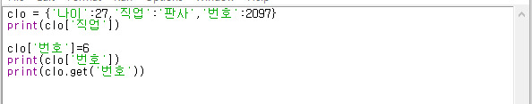


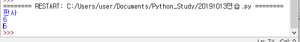

> 아래에는 일부러 에러를 만들어봄. 

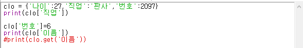


> get함수를 이용해서 다시 실행
>
> 

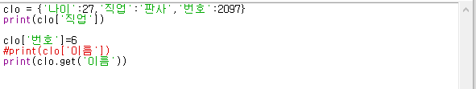


### 7. 키값 제거하기

```
del 딕셔너리[제거할 _ 키]
```


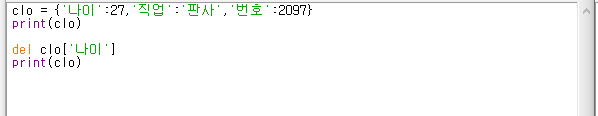


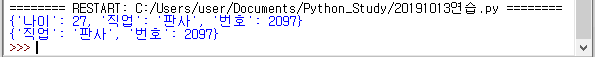


#### 7-1. 예제 

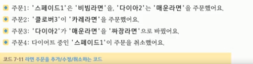


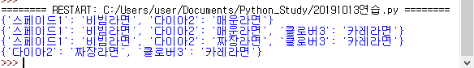


### 8. 모아서 한번에 보여주기: 함수


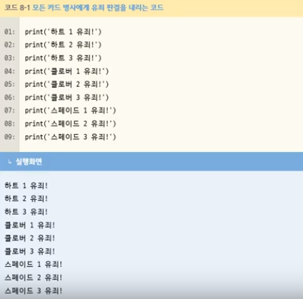

> 이걸 .. 언제 다 타이핑 하냐아~~~~~~~~~~~~~!

### 9. 함수

- 내장함수 : 파이썬에 포함이 되어져 있는 함수. (print, range...)

- 모듈의 함수 : 비슷한 함수 끼리 묶어놓은 함수. 

- 사용자 정의 함수 : 사용자가 직접 만드는 것.

  


### 10. 함수의 기본구조


```python
def 함수 이름(인수):
    실행할 명령
    return 반환값
```


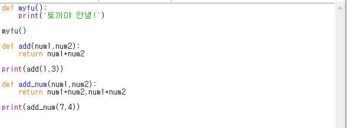


#### 10-1.예제


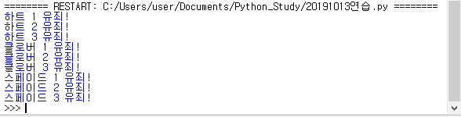


### 11. 모듈


> 파이썬 자체적으로 가지고 있는 모듈. 스스로 만드는 모듈. 다른 사람이 만든 모듈. 3가지 모두가 가능하다.


```
import 모듈 이름 / 모듈이름.함수()
```


#### 11-1.Random.choice


```python
random.choice(리스트)

# 고르는 데 결과가 랜덤하게 나오기 때문에 다를 수도 있다.
```


#### 11-2.Random.sample

```python
random.sample(리스트, 뽑을 개수)

#여러개의 값을 뽑는데 랜덤으로
```


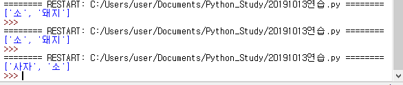


#### 11-3.Random.randint

```
random.randint(시작 값, 끝값)

```


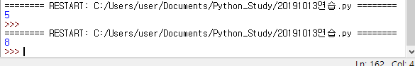


> 5부터 10까지의 숫자 중에서 하나


#### 11.4 예제


> 김왼손님의 답

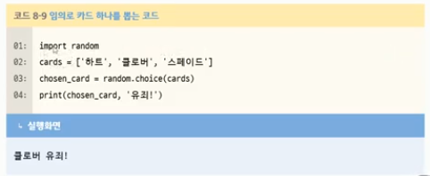


### 12. 모듈을 사용하는 이유

> 있는 바퀴를 만들지 마라! -> 시간도 엄청 걸리고, 비용도 많이 든다. 그래서 완성된 부품들이 있으면 그걸 쓰라는 말이다. 


