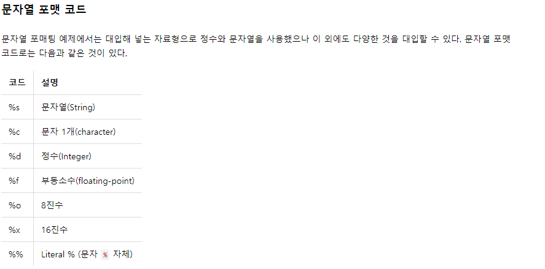

> 시작하기에 앞서: 파이썬을 공부하지도 않고 프로젝트때문에 공부를 했었다. 레포지터리에 가면 김왼손님의 강의도 들었다. 하지만, 여전히 부족한 점이 많다. 프로젝트 때는 딱 필요한 부분만 필요했기에 옵션 정도만 가볍게 보거나 복붙으로 진행을 했다. 김왼손님의 강의는 너무 간략했다. 한글로 치면, 가나다라의 자음 정도만 배운 느낌이다. 그래서 점프투 파이썬 DOC을 보면서 COPY를 하면서 간략하게 볼 부분은 짧은 시간만 사용을 하고, 처음 보는 부분이 있다면 자세하게 다룰 예정이다. 아.. 그리고 처음 보는 부분은.. 신기해서 이상한 단어들이 써있을 것이니, 신경쓰지 않으시길 ㅎㅎ 오늘도 눈부신 코딩을 공부하자!!


# 첫장


### 1. 숫자형 

:  숫자형(Number)이란 숫자 형태로 이루어진 자료형으로, 우리가 이미 잘 알고 있는 것이다. 우리가 흔히 사용하는 것을 생각해 보자. 123 같은 정수, 12.34 같은 실수, 드물게 사용하긴 하지만 8진수나 16진수 같은 것도 있다. 


#### 1-1. 정수형

정수형(int, integer) 양의 정수, 음의 정수, 숫자 0


#### 1-2. 실수형

실수형(float , Floating-point) 소수점이 포함된 숫자 여기서 **컴퓨터식 지수 표현 방식**이라는 것이 있다.

```
 a = 4.24E10
```

종종 통계분석을 하면 나오는 것이였는데, 위의 숫자에 대한 설명을 보니 위에 언급된 숫자는   4.24∗10^10 

```
a = 4.24e-10
```

위의 숫자는 4.24∗10^−10을 뜻한다. 


#### 1-3. 8진수와 16진수

**8진수** :  숫자가 0o 또는 0O(숫자 0 + 알파벳 소문자 o 또는 대문자 O)로 시작하면 된다. 

```
>> a = 0o177
```

**16진수** : 0x로 시작하면 된다. 

```
>>> a = 0x8ff
```


### 2. 연산자

일반적으로 사칙연산을 배우고 나면 여러 연산자들을 배운다. 일단 먼지는 알고 있으니 넘어가고 바로 제곱연산자부터 보자.

```
>>> a = 3
>>> b = 4
>>> a ** b
81
```

####  **2-1. 제곱연산자**

위의 박스에 있는 것처럼 ****** 을 이용해서 제곱의 값을 구해준다.


#### 2-2. 나머지 반환하는 연산자, 몫을 반환하는 연산자

```
>>> 7 % 3
1
>>> 3 % 7
3
```

**나머지만** 출력해주는 연산자이다.

```
>>> 7 / 4
1.75

>>> 7 // 4
1
```

위와 아래의 값이 다르게 출력이 되어져 있는 것을 볼 수가 있는데, 위에서는 1.75 실수값으로 아래에 //은 1 정수값을 취한 것을 알 수 있다.


### 2. 문자열이란?

문자열(str , string)은 문자 단어등으로 구성된 문자들의 집합을 의미한다.  문자열을 만드는 방법은 파이썬에서는 4가지가 있다,

```
"Hello World"
```

" "을 이용해서 둘러싸기

```
'Python is fun'
```

' '을 이용해서 둘러싸기

```
"""Life is too short, You need python"""
```

""" """을 이용해서 둘러싸기

```
'''Life is too short, You need python'''
```

''' ''' 을 이용해서 둘러싸기


#### 2-1. 특수한 경우

가끔 문자열에도 **'** 가 필요한 경우가 있다. 예를 들어서 영어에서 ~ 의 를 나태낼 때 Jun's piano 처럼 준의 피아노를 나타내고 싶지만, 일반적인 방법으로는 분명 문자열 취급을 받을 것이다. 그래서 아래의 방법을 사용한다.

```
>>> food = "Python's favorite food is perl"
```

위의 예시를 보면 " (내용) " 안에 **'** 넣어주었기 때문에, 문자열을 만드는 명령어로 활용이 되지 않는다. 만약 쌍따음표를 쓰지않으면 에러가 난다. 해봐라

그리고 어떤 사람의 대사같은 것을 표현하기 위해서는 " (대사) "를 사용하는데., 이때는 위와 반대로 **' '** 로 둘러 주면 문자열로 취급을 하지 않는다.


#### 2-2 .여러줄을 쓰고 싶을 때

이때는 2가지 방법이 있다. 첫번째로 /n을 이용하는 방법인데 이렇게 하면 엔터와 같은 결과를 가지고 온다. 두번째로 """ 와 ''' 을 이용한다. 위에서 한 줄로만 표현을 했지만, 여러 문장이 있다면 그 문단의 첫 번째 문장 앞과 마지막 문장 뒤에 넣어 주면  여러줄을 쓸 수 있다.


### 3. 문자열 연산하기

: 이것 참.. 일찍 알았다면 좋았을 내용이다.  오직 +만 알아서 썼었는데, *도 알았다면 한층더 코드치기가 쉬웠을 것 같다.

문자열 더하기는 .. 머... 문자열 두개가 있으면 앞에 나온 문자열뒤에 붙인다고 생각하면 될 것이다. 내가 신기한건 곱하기다!! 

```
a = "hi" 

a*100 

'hihihihihihihihihihihihihih.....'
```

위에 아주 쉬운 예제가 있다. 딱 보면 안다. hi를 100번 **반복** 한다.


### 4. 문자열 길이 구하기

len(a) 을 써주자. a에 있는 문자열을 카운트 해줄 것이다.


### 5. 문자열 인덱싱과 슬라이싱


#### 5-1. 문자열 인덱싱

인덱싱 부분에서 꼭 기억해야 할 점은 **"파이썬은 0부터 숫자를 센다"**이다.

```
a = "long"
```

위의 단어를 인덱싱을 하게되면 ㅣ= [0], o = [1].... 순으로 진행된다. 

오호... 여기서 다시 신기한 것 !!  a = [-0]은 멀까? 바로 뒤에서 부터 카운팅이 들어간다. 그래서 답은 g 가 나오게 된다.


#### 5-2. 문자열 슬라이싱

```
>>> a = "Life is too short, You need Python"
>>> a[0:4]
'Life'

a[시작 번호:끝 번호]
```

위의 문제를 보면 .. 좀 이상하지 않나? 0부터 4까지 이면 i까지 나와야 하는데, life만 출력이 될까? **이유는 [0:4] =  0<=a<4 즉 0<=a<=3이다. 이를 유의하자.**


이 외에도 a[19:] , a[:17] 이런 식으로도 가능한데,  끝 번호가 없을 경우에는 시작 번호 부터 터 끝까지 다 나오게 된다.반대로 시작 번호가 없으면 끝번호까지만 나오게 된다.  그리고 이런 방식을 이용하여 문자열을 나누기도 한다.


```python
>>> a = "20010331Rainy"
>>> date = a[:8]
>>> weather = a[8:]
>>> date
'20010331'
>>> weather
'Rainy
```


### 6. 문자열 포매팅

```
현재 온도는 18도 입니다.
현재 온도는 20도 입니다.
```


**문자열 포매팅**:  위 두 문자열은 모두 같은데 20이라는 숫자와 18이라는 숫자만 다르다. **이렇게 문자열 안의 특정한 값을 바꿔야 할 경우가 있을 때 이것을 가능하게 해주는 것이 바로 문자열 포매팅 기법이다.**

**쉽게 말해 문자열 포매팅이란 문자열 안에 어떤 값을 삽입하는 방법이다.** 





위에 문자열 포맷 코드들이 있다. 이를 이용한 예제로

```
>>> "I have %d apples" % 3
'I have 3 apples'
>>> "rate is %s" % 3.234
'rate is 3.234'
```

위에 코드가 있따. 이코드를 보고 유추를 하자면, d에는 3이 라는 숫자가 들어갈 것이다. 그런데 아래에 %s에는 3.234가 들어가는데, 이게 어떻게 된 것일까? 답은 파이썬에서는 이렇게 코드를 짤 경우에 3.234가 문자열로 바뀌어서 들어가게 된다.


<**주의**>

퍼센티지를 나타내려하면 아마 당장 생각한다면, 위에서 예제를 사용한다면,

```
"I have %d% apples" % 3
```

라고 생각 할지도 모른다. 하지만 이는 파이썬에서는 통용되지 않는다. 에러가 뻥 하고 날 것이다. 퍼센티지로 표현을 해주고 싶다면, %%를 이용한다. 즉

```
"I have %d%% apples" % 3
```

를 이용하게되면 3%센트 라는 값이 나오게 될 것이다.


### 7. 포맷 코드와 숫자 함께 사용하기


#### 7-1. 정렬과 공백

```
>>> "%10s" % "hi"
'        hi'
```

앞의 예문에서 `%10s`는 전체 길이가 10개인 문자열 공간에서 대입되는 값을 오른쪽으로 정렬하고 그 앞의 나머지는 공백으로 남겨 두라는 의미이다.

그렇다면 반대쪽인 왼쪽 정렬은 `%-10s`가 될 것이다. 확인해 보자.

```
>>> "%-10sjane." % 'hi'
'hi        jane.'
```

hi를 왼쪽으로 정렬하고 나머지는 공백으로 채웠음을 볼 수 있다.


#### **7-2. 소수점 표현하기**

```
>>> "%0.4f" % 3.42134234
'3.4213'
```

3.42134234를 소수점 네 번째 자리까지만 나타내고 싶은 경우에는 위와 같이 사용한다. 즉 여기서 '.'의 의미는 소수점 포인트를 말하고 그 뒤의 숫자 4는 소수점 뒤에 나올 숫자의 개수를 말한다. 다음 예를 살펴보자.

```
>>> "%10.4f" % 3.42134234
'    3.4213'
```

위 예는 숫자 3.42134234를 소수점 네 번째 자리까지만 표시하고 전체 길이가 10개인 문자열 공간에서 오른쪽으로 정렬하는 예를 보여 준다.


8번 format 함수를 사용한 포매팅은 내일 다시 ~~ 좋은 책 인것 같다. !!


