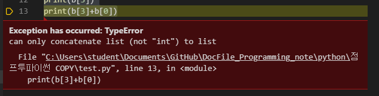

# 20191113 리스트 자료형

지금까지 숫자형, 문자형 두가지를 공부를 했다. 지금까지 한 것만으로는, 우리가 앞으로 코드를 짜는 것에 있어서 상당히 부족한 감이 있을 것이다. 그래서 중간중간 **[ ... ]** 와 같은 것들을 보았을 것이다. 이것이 바로 **파이썬에서 리스트** 라고 불리는 부분이다.  


리스트를 사용하면 숫자형, 문자형을 아래와 같이 한방에, 편하게 나타낼 수 있다.

```python
>>> odd = [1, 3, 5, 7, 9]
리스트명 = [요소1, 요소2, 요소3, ...]

>>> a = []
>>> b = [1, 2, 3]
>>> c = ['Life', 'is', 'too', 'short']
>>> d = [1, 2, 'Life', 'is']
>>> e = [1, 2, ['Life', 'is']]
```

대괄호와 그안에 요소 1과 2... 가 있을 것이다. 숫자형은 쉼표 사이에 있고, 문자형은 '문자형' 으로 리스트안에 넣는다. 그리고 비어도 되고, 문자형과 숫자형이 같이 들어가도 되고, 리스트 안에 리스트가 들어가도 된다.


### 1. 리스트의 인덱싱과 슬라이싱

자.. 위에서 공부를 했으니 복습한다 생각하고 바로 실습을 해본다.

```python
a = [1,2,3,4]
print(a)
print(a[0])
print(a[0]+a[2])
print(a[-1])

```

결과

```
[1, 2, 3, 4]
1
4
4
```

이번에는 조금 더 복잡한 구조의 리스트를 연습해보자

```python
b=[1, 2, 3, ['a', 'b', 'c']]
print(b)
print(b[0])
print(b[1])
print(b[-1])
print(b[3])
print(b[3]+b[0])
print(b[-1][0])
```

여기서 에러가 나는 것이 있다. 머일까요요요요?

바로 마지막에 위치한  print(b[3]+b[0]) 이 녀석이다. 왜냐하면, b[0]는 int 1 이고 b[3] 은 ['a', 'b', 'c'] 이다.  문자열과 숫자열을 더하면.. 답이 나올까? 당연히 아니다. 에러가 벙하고 나온다.



 그래서 에러가 나는 부분을 주석처리를 해주고 결과값들을 보자

```
[1, 2, 3, ['a', 'b', 'c']]
1
2
['a', 'b', 'c']
['a', 'b', 'c']
a
```

마지막에 a 는 어떻게 나왔을까? **print(b[-1] [0])** 을 해석을 하면  b[-1] 에 위치한 [0]번째를 말하는 거라한다. 그래서 답은 **a**


