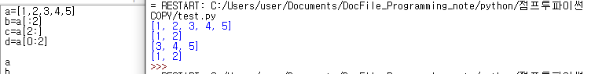
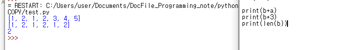

# 20191116 List


### list  의 슬라이싱


: 이전에 했던 문자열의 슬라이싱과 동일하다. 


```
a=[1,2,3,4,5]
b=a[:2]
c=a[2:]
d=a[0:2]
```



```
print(b+a)
print(b*3)
print(len(b))

연산자를 이용한 모습이다. 문자열과 똑 ~ 같이 출력을 한다.
```





```
a[2] = 100
del a[0]
print(a)
```

```
결과
오리지널 : [1, 2, 3, 4, 5]
바뀌고, 삭제되고 : [2, 100, 4, 5]
```


### list의 함수


#### append


```
a=[1, 2, 3, 4, 5]
a.append(19)
print(a)
```

```
결과

[1, 2, 3, 4, 5, 19]
```


```
에러 확인
d=a[0:2]
d.append(15,7)
```

```
결과
Traceback (most recent call last):
  File "C:/Users/user/Documents/DocFile_Programming_note/python/점프투파이썬 COPY/test.py", line 15, in <module>
    d.append(15,7)
TypeError: append() takes exactly one argument (2 given)

맨 아래의 문장을 보면, append() 에는 1개의 argument 만 들어갈 수 있다고 한다.
그래서 append 안에 들어간 부분을 리스트로 바꿔주면..


```

```
d.append([15,7])
```

```
[1, 2, [15, 7]]

위와 같이 나온다. 그래서  append 함수를 여러번 사용하기 위해서 for문을 많이 써주는 것 같다.
```


#### Sort & reverse


```
a=[1,2,3,4,5]
a[2] = 100
del a[0]
print(a)
```

```
[2, 100, 4, 5]
```

```
a.sort()
print(a)
```

```
[2, 4, 5, 100]

아래차순으로 정렬을 해준다. 그리고 이와 반대되는 함수가 reverse()함수인데..
```

```
a.reverse()
print(a)
```

```
[100, 5, 4, 2]

위에서 나왔던 리스트의 정렬과 반대로 나오게 된다.
```


#### index == 위치 반환


```
a=[1,2,3,4,5]
a.indext(3)
```

```
2 
두번째에 있다고 떡하니 나온다. 기억해야 할 것이 0부터 시작!!!
```

```
그런데 만약 값이 없는 값의 인덱스를 출력할려고 시도를 하면?

print(a.indext(19))
```

```
Traceback (most recent call last):
  File "C:/Users/user/Documents/DocFile_Programming_note/python/점프투파이썬 COPY/test.py", line 28, in <module>
    print(a.indext(19))
AttributeError: 'list' object has no attribute 'indext'
>>> 
바로 에러나죠~~~~~~~~~~~~~~
```


#### insert

```
a=[1,2,3,4,5]
a.insert(0,99)

print(a)
```

```
[99, 1, 2, 3, 4, 5]
```


insert함수를 설명을 약간 하자면 **변수명.insert(인덱스,넣고싶은 값)** 이라고 생각하면 된다.


#### remove & pop == 제거하기 & 끄집어내기

```
b=[1,2,1,2,3]

Q1
b.remove(1)
print(b)

Q2
b.pop()
print(b)

Q3
b=[2, 1, 2, 3]
b.pop(2)
print(b)
```

**결과**

```
Q1
[2, 1, 2, 3]
1 이 처음에는 1개였다. remove함수를 사용하면, 첫번째 1만 제거된다.
```

```
Q2
[2, 1, 2]
pop()함수를 사용하면, 마지막 함수는 제거된다.
```

```
Q3 
[2, 1, 2, 3]
[2, 1, 3]

이를 통해서 알 수 있는 것은, 2를 제거해주지만, 마지막에 위치한 2를 제거한다.
```


