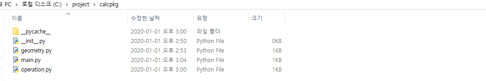

# 패키지


**패키지:** 패키지는 도트(.)를 사용하여 파이썬 모듈을 계층적(디렉터리 구조)으로 관리할 수 있게 해준다.  조금 쉽게 말하자면, 파이썬 모듈들을 모아둔 폴더(디렉터리)가 있다고 생각하면 된다. 

예를 들어서 모듈 이름이 A.B인 경우에는 A는 패키지 이름이 되고,B는 A패키지의 B모듈이 된다.

```
#game패키지의 예
game/ 
    __init__.py
    sound/
        __init__.py
        echo.py
        wav.py
    graphic/
        __init__.py
        screen.py
        render.py
    play/
        __init__.py
        run.py
        test.py
```

 위의 코드를 그대로 해석을 해보자면, game 디렉터리가 이 패키지의 루트 디렉터리이고, sound, graphic, play등이 서브 디렉터리이다. 이러한 구조로 코딩을 하게 되면, 공동작업이나 유지 보수 등 여러면에서 유리하다. 또한 패키지 구조로 모듈을 만들면, 다른 모듈과 이름이 겹치더라도 더 안전하게 사용할 수 있다.


패키지는 폴더(디렉토리)로 구성 되어 있음

### 패키지 만들기


> 참고사이트: https://dojang.io/mod/page/view.php?id=2449
>
> 





위의 상위폴더와 하위폴더, 그리고 .py 파일들을 구성했습니다. 

1. __init__.py 파일을 만들어줍니다.(아직은 왜 만들어주는 지 모르겠네요. 아래에서 나옵니다.)
2. geometry , operation 두개의 파일을 만들어 줍니다.


```
def add(a,b):
    return a+b


def mul(a,b):
    return a*b

>> operation.py
```


```
def triangle_arae(base,height):
    return base*height/2

def rectangle_area(width, height):
    return width * height

>> geometry 
```


3. 마지막으로 main.py를 만들어 줍니다.

```

import operation
import geometry

print(operation.add(10,20))
print(operation.mul(10,20))

print(geometry.triangle_arae(30,40))
print(geometry.rectangle_area(30,40))
 
 
main.py
```


### __init__.py 

이건 도대체 무슨 역할을 하는 것인가? 파일 안에 아무런 소스도 없고말이지.. 이녀석의 용도는 아래와 같다.

```
__init__.py 파일은 해당 디렉터리가 패키지의 일부임을 알려주는 역할을 한다. 만약 game, sound, graphic 등 패키지에 포함된 디렉터리에 __init__.py 파일이 없다면 패키지로 인식되지 않는다.
```


> ※ python3.3 버전부터는 `__init__.py` 파일이 없어도 패키지로 인식한다([PEP 420](https://www.python.org/dev/peps/pep-0420/)). 하지만 하위 버전 호환을 위해 `__init__.py` 파일을 생성하는 것이 안전한 방법이다.


