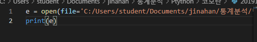
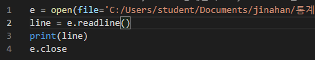
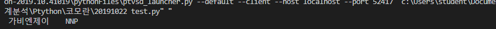
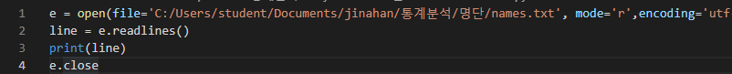
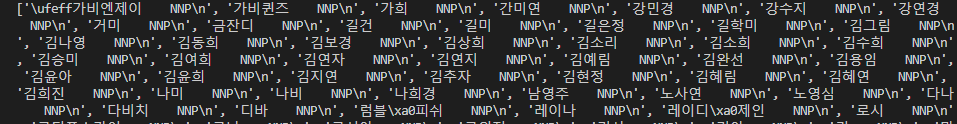
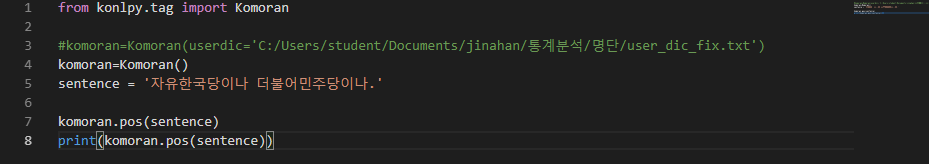
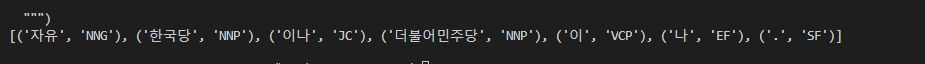
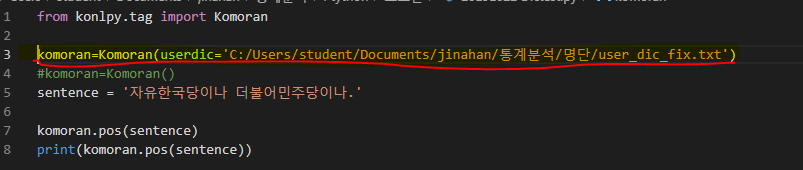
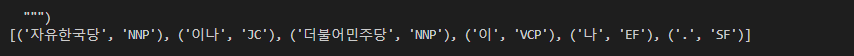
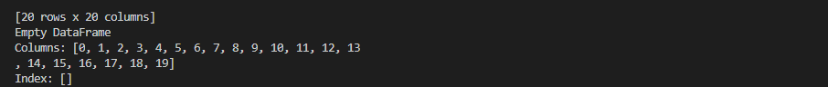

# 그날 그날의 파이썬 정리

> 아직은 많지 않은 정보이기에 날짜별로 배운 파이썬을 정리합니다. 추후에 많은 내용이 쌓이게 되면 다시한번 손을 봐서 책의 목차처럼 쭉 진행을 할까 합니다. 혹시나 부족한 부분이 있다면 말씀해주시면 감사하겠습니다.

## 20191022

### 1. 파일 읽고 쓰기

> 위와 같이 하면 나는 읽고 열리는 줄 알고 있었는데 아니다. 흠..... 멀까?

### 1-1.파일 읽는 방법 readline()

(구글링중.....)

> 위의 코드를 치니 결과가 아래처럼 하나만 나온다.

> 그래서 **readlines()**라고 고쳐보았다. 그랬더니, 아래의 결과가 떴다. 

### 2. Komoarn 사용자 사전 추가

> 많은 명사(특히나 고유명사)들이 아직 코모란 사전에 들어가 있지 않다. 예를 들어서 문재인 대통령 이라고 하면 '문재' + '인' 이런 식으로 형태소 분석을 하기 때문에 사용자 사전에 추가하는 일은 꼭 필요한 일이다. 아래의 코드로 짜고, 분석을 해보았다.

> 결과값에 보면('자유', 'NNG'), ('한국당', 'NNP') 으로 나온것을 볼 수 있다.
>
> 그래서 딕셔너리에 추가를 하고 다시 코드를 실행해보았다.

> '자유한국당', 'NNP' 하나의 단어로 인식하는 것을 확인 할 수 있다.

### 3.NAN

>  NAN : not a number 의 줄임말이다. 이 녀석은 값을 만들때, infinite값, 누락된값 들이 생기면서 발생되는 값들이다. 그래서 데이터 전처리과정에서 꼭 예외처리를 해야 한다. 

#### 3-1. Dropna 

> Dropna  함수는 열에 NAN값이 있으면 해당 내용은 필요없다고 간주하고 그 열을 삭제하게 된다. 그래서 아래의 그림처럼 리스트 안이 비어있다.

### 

### 4. 파이썬으로 짜는 상관분석(시간관계상 일단 보류)

> 상관분석: 상관분석은 확률론과 통계학에서 두 변수간에 어떤 선형적 관계를 갖고 있는 지를 분석하는 방법입니다.
>
> https://blog.naver.com/answls7337/221669893646

> 파이썬에서 상관분석을 하기위해서는 Pandas에서 제공하는 함수를 사용해야 합니다. 

### 5. K-means

> K-평균 알고리즘: 주어진 데이터를 k개의 클러스터로 묶는 알고리즘으로, 각 클러스터와 거리 차이의 분산을 최소화하는 방식으로 동작한다. 이 알고리즘은 자율 학습의 일종으로, 레이블이 달려 있지 않은 입력 데이터에 레이블을 달아주는 역할을 수행한다.

#### 5-1. K-means Clustering 

> K-means 알고리즘은 굉장히 단순한 클러스터링 기법 중에 하나이다. 어떤 데이터 셋(set)이 있고 N개의 클러스터로 분류하겠다고 가정하면, 그 데이터 셋에는 N개의 중심(centroid)이 존재한다. 각 데이터들은 유클리디안 거리를 기반으로 가까운 중심에 할당되고, 같은 중심에 모인 데이터 그룹이 하나의 클러스터가 된다.

#### 5-2. 학습방식

> K-means Clustering 을 하기 위해서 우선 우리는 EM알고리즘을 알아야 한다. EM은 Expectation, Maximization을 의미한다. 가장 먼저 클러스터의 수를 정해야 한다. 2개면 2개 3개면 3개로 말이다. 
>
> 다음으로 Expectation을 먼저 시작하는데, 이 과정은 유클리디안 거리를 구해서 가장 가까운 중심을 구하기 위해서 진행한다.
>
> 그리고 클러스터를 2개로 구성하기 했다면, 그 두개의 중심을 찾는 과정을 Maximiztion단계라고 한다. 각각의 과정은 그 군집의 평균을 기준으로 해서 학습을 진행 한다. 
>
> 위와 같은 방법을 계속 반복해서 진행을 하면 아래의 그림과 같이 군집이 모이는 것을 볼 수 있다.

> K-means출처 : 위키피디아
>
> 5-1. K-means Clustering 출처: https://medium.com/@nsh235482/k-means-clustering-6ab85a2a32ad
>
> 5-2. 학습방식 출처 : http://stanford.edu/~cpiech/cs221/img/kmeansViz.png

